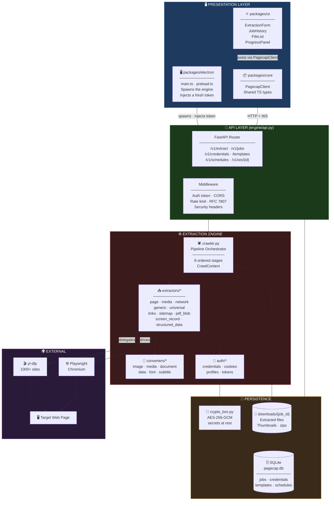
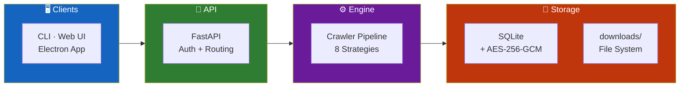
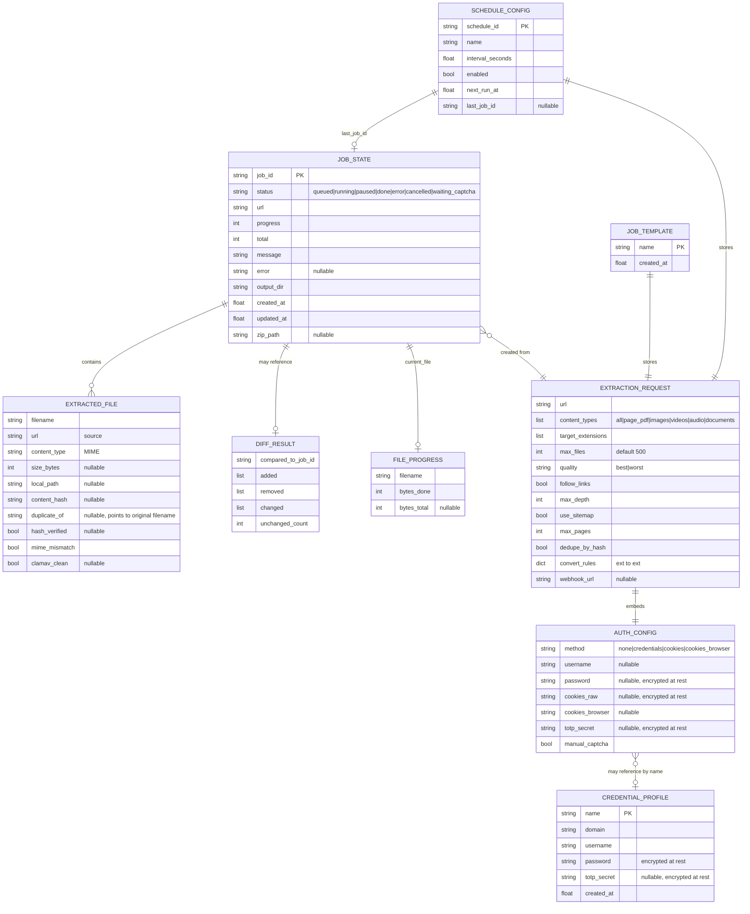
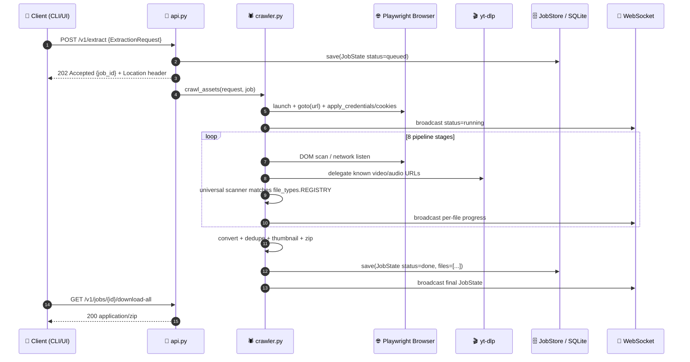
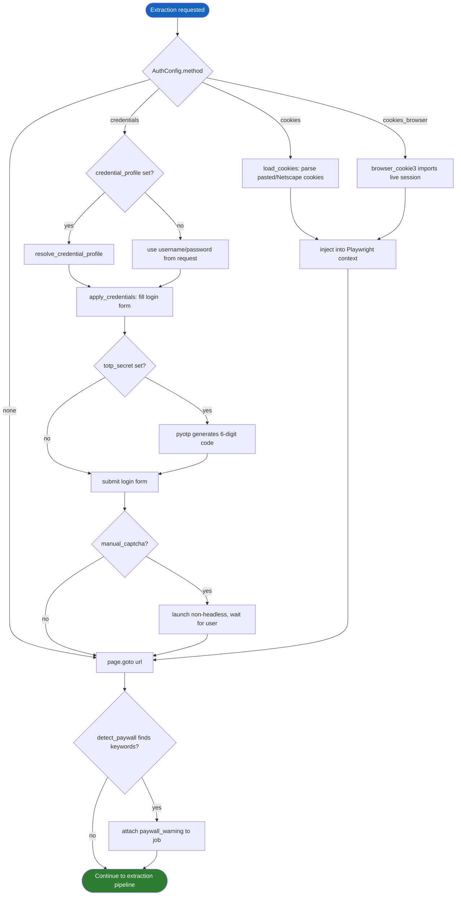
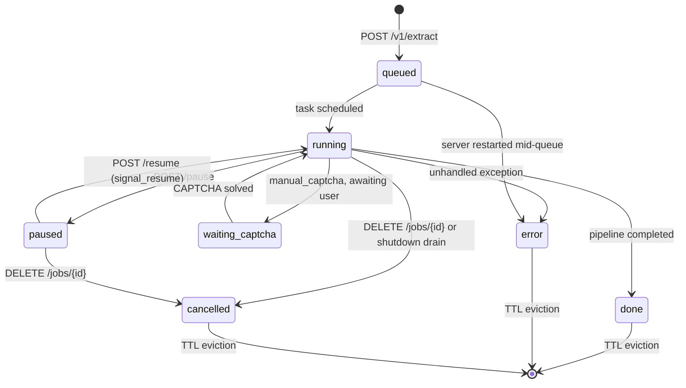
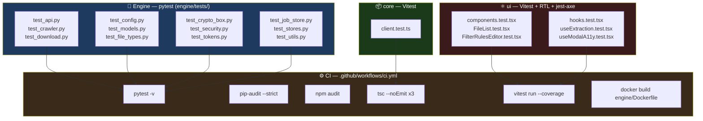

<div align="center">

**🌐 Choose Language / Selecione o Idioma / Elija el Idioma**

[](README.md)&nbsp;&nbsp;&nbsp;[](README_PT.md)&nbsp;&nbsp;&nbsp;[](README_ES.md)

</div>

---

<div align="center">

```
██████╗  █████╗  ██████╗ ███████╗ ██████╗ █████╗ ██████╗
██╔══██╗██╔══██╗██╔════╝ ██╔════╝██╔════╝██╔══██╗██╔══██╗
██████╔╝███████║██║  ███╗█████╗  ██║     ███████║██████╔╝
██╔═══╝ ██╔══██║██║   ██║██╔══╝  ██║     ██╔══██║██╔═══╝
██║     ██║  ██║╚██████╔╝███████╗╚██████╗██║  ██║██║
╚═╝     ╚═╝  ╚═╝ ╚═════╝ ╚══════╝ ╚═════╝╚═╝  ╚═╝╚═╝
        Extract Any Content From Any Web Page
```

---

[](https://www.python.org/)
[](https://fastapi.tiangolo.com/)
[](https://playwright.dev/)
[](https://www.typescriptlang.org/)
[](https://react.dev/)
[](https://www.electronjs.org/)
[](LICENSE)

<br/>

> **PageCap crawls a web page with a real browser and pulls out everything on it**
> images, video, audio, documents, or the whole page as a PDF, through a CLI, a REST/WebSocket API, or a desktop app.

<br/>


</div>

---

## 📑 Table of Contents

<details>
<summary>▶️ <strong>Click to expand / collapse this section</strong></summary>

<table>
<tr>
<td valign="top" width="50%">

**🏗️ System**
- [Overview](#-overview)
- [System Architecture](#️-system-architecture)
- [Technology Stack](#️-technology-stack)
- [Design Patterns](#-design-patterns-applied)
- [Project Structure](#-project-structure)

**📦 Modules**
- [api.py — HTTP/WebSocket Server](#-apipy--httpwebsocket-server)
- [cli.py — Command-Line Interface](#-clipy--command-line-interface)
- [extractors/crawler.py — Pipeline Orchestrator](#-extractorscrawlerpy--pipeline-orchestrator)
- [extractors/ — Extraction Strategies](#-extractors--extraction-strategies)
- [converters/ — Post-Download Conversion](#-converters--post-download-conversion)
- [auth/ — Credentials, Cookies, Tokens](#-auth--credentials-cookies-tokens)
- [job_store.py & stores.py — Persistence](#-job_storepy--storespy--persistence)
- [crypto_box.py — Secrets Encryption](#-crypto_boxpy--secrets-encryption)
- [security.py & paywall.py — Content Safety](#-securitypy--paywallpy--content-safety)
- [packages/core — TypeScript Client](#-packagescore--typescript-client)
- [packages/ui — React Web Interface](#-packagesui--react-web-interface)
- [packages/electron — Desktop Wrapper](#-packageselectron--desktop-wrapper)

</td>
<td valign="top" width="50%">

**💼 Business**
- [Business Rules](#-business-rules)
- [Functional Requirements](#-functional-requirements)
- [Non-Functional Requirements](#-non-functional-requirements)

**📐 Design**
- [Data Model](#️-data-model)
- [System Flows](#-system-flows)
- [Extraction Job Flow](#extraction-job-flow)
- [Authentication Flow](#authentication-flow)
- [Pause / Resume / Cancel](#job-lifecycle-state-machine)

**🔐 Security & Ops**
- [Security](#-security)
- [Installation & Execution](#-installation--execution)
- [Automated Tests](#-automated-tests)
- [Metrics & Monitoring](#-metrics--monitoring)
- [Known Limitations](#️-known-limitations)

</td>
</tr>
</table>

---

</details>

## 🌟 Overview

<details>
<summary>▶️ <strong>Click to expand / collapse this section</strong></summary>

**PageCap** is a content-extraction toolkit built around a Python engine that drives a real Playwright browser against any URL and pulls out whatever is on the page: images, videos, audio, PDFs, office documents, fonts, subtitles, archives, and more, across a registry of 150+ recognized file types (`engine/file_types.py`). It is exposed three ways: a Typer-based CLI (`engine/cli.py`) for scripting and one-off jobs, a FastAPI REST + WebSocket server (`engine/api.py`) for programmatic and UI clients, and a React + Electron desktop application (`packages/ui`, `packages/electron`) that talks to that same server as a local process.

The extraction engine is not a single scraper but an ordered pipeline of independent strategies (`engine/extractors/crawler.py`): a page-to-PDF capture, `yt-dlp` for the 1000+ sites it understands natively, raw network-request interception for HLS/DASH streams and custom players, a DOM scan for direct ``/`<video>`/`<audio>` tags and linked files, a universal scanner that matches every registered extension against both the DOM and observed network traffic, an optional recursive same-domain crawl (link-following or sitemap-driven), a plugin stage for user-supplied extractors, and, as a last resort, screen recording of whatever renders on screen. Everything downloaded can optionally be converted to another format, deduplicated by content hash, thumbnailed, MIME-verified, and zipped, and every job is tracked as durable state in SQLite so progress survives a server restart.

PageCap treats the local HTTP API as a real trust boundary rather than an implementation detail: authentication is required by default (a token is generated on first boot if none is configured), CORS is scoped to `localhost`/`127.0.0.1` plus explicit exceptions, secrets (site passwords, TOTP seeds, raw cookies) are encrypted at rest with AES-256-GCM, and every response follows RFC 7807 problem-details with a `X-Request-ID` that ties back to structured JSON logs. Two ADRs (`docs/adr/`) document why: ADR-001 explains that `127.0.0.1` is reachable by any web page the user visits and is therefore not a trust boundary by itself, and ADR-002 explains why every route is mounted under `/v1` with the legacy unversioned paths kept alive but marked `Deprecation`/`Sunset`.

### 🎯 System Objectives

| Objective | Description |
|-----------|-------------|
| 🌐 **Universal extraction** | Recognize and download 150+ file types across images, video, audio, documents, fonts, subtitles, data, archives, code, 3D and ML formats |
| 🎬 **Video/audio at scale** | Delegate to `yt-dlp` for 1000+ known platforms, and fall back to raw network interception for HLS/DASH and custom players |
| 📄 **Whole-page capture** | Render the page in a real browser and export it as a single PDF via Playwright's print pipeline |
| 🔐 **First-class authentication** | Support username/password, pasted cookies, browser-cookie import, TOTP 2FA, and manual CAPTCHA solving for gated content |
| 🕸️ **Recursive crawling** | Optionally follow same-domain links or a sitemap to extract from many pages in one job |
| 🔄 **Conversion & dedup** | Convert downloaded files to another format, drop byte-identical duplicates by content hash, and generate thumbnails |
| 📡 **Live progress** | Stream job status, per-file byte progress, and diffs against a previous run over WebSocket |
| 🖥️ **Three surfaces, one engine** | CLI, REST/WebSocket API, and an Electron desktop app all drive the exact same extraction pipeline |
| 🔒 **Secure by default** | API tokens, encrypted secrets, RFC 7807 errors, rate limiting, MIME verification and optional ClamAV scanning |

---

</details>

## 🏗️ System Architecture

<details>
<summary>▶️ <strong>Click to expand / collapse this section</strong></summary>

### Module Diagram



### Architecture Layers



---

</details>

## 🛠️ Technology Stack

<details>
<summary>▶️ <strong>Click to expand / collapse this section</strong></summary>

<table>
<thead>
<tr>
<th>Layer</th>
<th>Technology</th>
<th>Version</th>
<th>Purpose</th>
</tr>
</thead>
<tbody>
<tr>
<td rowspan="4"><strong>🐍 Engine Core</strong></td>
<td>Python</td>
<td>3.10+</td>
<td>Extraction engine language</td>
</tr>
<tr>
<td>FastAPI</td>
<td>0.115+</td>
<td>REST + WebSocket server (<code>engine/api.py</code>)</td>
</tr>
<tr>
<td>Uvicorn</td>
<td>0.30+</td>
<td>ASGI server (<code>uvicorn[standard]</code>)</td>
</tr>
<tr>
<td>Pydantic</td>
<td>2.9+</td>
<td>Request/response models (<code>engine/models.py</code>)</td>
</tr>
<tr>
<td rowspan="3"><strong>🌐 Browser & Media</strong></td>
<td>Playwright</td>
<td>1.47+</td>
<td>Headless/headful Chromium automation, page→PDF</td>
</tr>
<tr>
<td>yt-dlp</td>
<td>2024.9+</td>
<td>Video/audio download across 1000+ sites</td>
</tr>
<tr>
<td>httpx</td>
<td>0.27+</td>
<td>Async HTTP downloads, sitemap fetches</td>
</tr>
<tr>
<td rowspan="2"><strong>💻 CLI</strong></td>
<td>Typer</td>
<td>0.12+</td>
<td><code>engine/cli.py</code> — <code>extract</code>, <code>server</code>, <code>token</code> commands</td>
</tr>
<tr>
<td>Rich</td>
<td>13.8+</td>
<td>Progress bars, tables, colored console output</td>
</tr>
<tr>
<td rowspan="2"><strong>🔐 Auth</strong></td>
<td>browser-cookie3</td>
<td>0.19+</td>
<td>Import live cookies from Chrome/Firefox/Edge/Brave/Opera/Safari</td>
</tr>
<tr>
<td>pyotp / cryptography</td>
<td>2.9+ / 43.0+</td>
<td>TOTP 2FA codes · AES-256-GCM secret encryption</td>
</tr>
<tr>
<td rowspan="5"><strong>🔁 Conversion</strong></td>
<td>Pillow + pillow-heif + pillow-avif-plugin</td>
<td>10.4+ / 0.18+ / 1.4+</td>
<td>Image conversion incl. HEIC/HEIF and AVIF</td>
</tr>
<tr>
<td>cairosvg / rawpy</td>
<td>2.7+ / 0.23+</td>
<td>SVG → PNG/PDF · Camera RAW (CR2, NEF, ARW…)</td>
</tr>
<tr>
<td>pandas / openpyxl / odfpy / pyarrow / fastavro</td>
<td>2.2+ / 3.1+ / 1.4+ / 17.0+ / 1.9+</td>
<td>Tabular conversion: CSV, XLSX, ODS, Parquet, Avro</td>
</tr>
<tr>
<td>fonttools / brotli</td>
<td>4.53+ / 1.1+</td>
<td>Font format conversion + WOFF2 compression</td>
</tr>
<tr>
<td>pysubs2 / pdfminer.six</td>
<td>1.7+ / 20221105+</td>
<td>Subtitle conversion · PDF text fallback extraction</td>
</tr>
<tr>
<td rowspan="4"><strong>⚛️ Web UI</strong></td>
<td>React</td>
<td>18.3</td>
<td><code>packages/ui</code> — component tree</td>
</tr>
<tr>
<td>Vite</td>
<td>8.1</td>
<td>Dev server + build</td>
</tr>
<tr>
<td>TypeScript</td>
<td>5.6</td>
<td>Shared across all three npm workspaces</td>
</tr>
<tr>
<td>lucide-react</td>
<td>0.441+</td>
<td>Icon set</td>
</tr>
<tr>
<td rowspan="2"><strong>🖥️ Desktop</strong></td>
<td>Electron</td>
<td>43</td>
<td><code>packages/electron</code> — spawns the engine, injects a token</td>
</tr>
<tr>
<td>electron-builder</td>
<td>26.15+</td>
<td>NSIS (Windows) / DMG (macOS) / AppImage (Linux) packaging</td>
</tr>
<tr>
<td rowspan="2"><strong>📦 Shared Client</strong></td>
<td>axios</td>
<td>1.7+</td>
<td><code>packages/core</code> — <code>PagecapClient</code> HTTP wrapper</td>
</tr>
<tr>
<td>vitest</td>
<td>4.1+</td>
<td>Unit tests for <code>core</code> and <code>ui</code></td>
</tr>
<tr>
<td rowspan="3"><strong>🧪 Testing & QA</strong></td>
<td>pytest</td>
<td>—</td>
<td>Engine test suite (<code>engine/tests/</code>, <code>pytest.ini</code>)</td>
</tr>
<tr>
<td>@testing-library/react + jest-axe</td>
<td>16.3+ / 9.0+</td>
<td>UI component tests + accessibility assertions</td>
</tr>
<tr>
<td>pip-audit / npm audit</td>
<td>—</td>
<td>Dependency vulnerability scanning in CI</td>
</tr>
</tbody>
</table>

---

</details>

## 🎨 Design Patterns Applied

<details>
<summary>▶️ <strong>Click to expand / collapse this section</strong></summary>

| Pattern | Where | Rationale |
|---------|-------|-----------|
| 🚏 **Pipeline / Chain of Responsibility** | `extractors/crawler.py` — `_Stage` list run in sequence over a shared `CrawlContext` | Adding or reordering an extraction strategy means editing a list, not a 400-line function; every stage gets uniform cancellation/pause handling for free |
| 🧺 **Context Object** | `CrawlContext` dataclass | Bundles ~15 pieces of shared state so stages become independently testable functions instead of closures |
| 🏭 **Registry** | `file_types.REGISTRY`, `_CT_TO_CATEGORIES` in `crawler.py` | 150+ file types and their conversion targets are declared as data, looked up by extension, not branched on in code |
| 🔌 **Plugin / Extension Point** | `plugins.py` — `load_plugins()` imports any `extract()` in `PAGECAP_PLUGINS_DIR` | Third-party extraction stages are added without touching core code, isolated so a broken plugin cannot crash a job |
| 🎯 **Facade** | `auth/credentials.py::apply_credentials`, `auth/cookies.py::load_cookies` | One call each hides Playwright form-fill, TOTP generation, and browser-cookie-jar parsing behind a simple signature |
| 🛡️ **Fail-Closed Guard** | `api.py::_is_authorized`, `_websocket_allowed` | Every route except `/health*` is denied unless proven authorized; there is no implicit-allow branch |
| 🧊 **Immutable Configuration** | `config.py::Settings` — frozen `dataclass`, read once at import | Prevents the historical bug where `api.py` and `auth/profiles.py` each read `os.getenv` independently and could disagree |
| 🔁 **Strategy** | `converters/*.py` — one module per media category (image, document, data, font, subtitle, media) | Conversion logic varies completely per format family; each converter is swapped in by declared `can_convert_to` targets |
| 🌊 **Async Generator / Streaming** | Extractor functions `yield ExtractedFile` as they find them | Files appear in the UI as soon as they are found, not after the whole page finishes crawling |
| 🚦 **Circuit-Breaker-style Draining** | `api.py::_drain_jobs` on shutdown | In-flight jobs get a bounded grace window to finish cleanly instead of being killed mid-write |

---

</details>

## 📁 Project Structure

<details>
<summary>▶️ <strong>Click to expand / collapse this section</strong></summary>

```
PageCap/
│
├── 📄 package.json                    # npm workspace root: dev/build/test scripts for all 3 packages
├── 📄 package-lock.json
├── 📄 setup.bat / setup.sh            # One-shot environment bootstrap (Windows / Unix)
├── 📄 .env.example                    # Every PAGECAP_* environment variable, documented
├── 📄 LICENSE                         # MIT
│
├── 📂 engine/                         # 🐍 Python extraction engine
│   ├── 📄 api.py                      # FastAPI REST + WebSocket server, job lifecycle, middleware
│   ├── 📄 cli.py                      # Typer CLI: extract / server / token commands
│   ├── 📄 config.py                   # Frozen Settings dataclass — single source of env config
│   ├── 📄 models.py                   # Pydantic models: ExtractionRequest, JobState, etc.
│   ├── 📄 converter.py                # Dispatches to the right converters/* module by extension
│   ├── 📄 crypto_box.py               # AES-256-GCM encryption for stored secrets
│   ├── 📄 download.py                 # Chunked async download with retry, hashing, progress
│   ├── 📄 file_types.py               # Registry of 150+ recognized extensions and MIME types
│   ├── 📄 job_store.py                # SQLite persistence for JobState (survives restarts)
│   ├── 📄 logging_config.py           # Structured JSON logging + request-id context
│   ├── 📄 paywall.py                  # Heuristic paywall/login-wall text detection
│   ├── 📄 plugins.py                  # Loads user-supplied extractor plugins
│   ├── 📄 problem_details.py          # RFC 7807 error responses
│   ├── 📄 security.py                 # Magic-byte MIME sniffing + optional ClamAV scan
│   ├── 📄 stores.py                   # SQLite persistence for credentials/templates/schedules
│   ├── 📄 thumbnails.py               # Thumbnail generation for extracted media
│   ├── 📄 utils.py                    # Shared helpers
│   ├── 📄 requirements.txt            # Runtime Python dependencies
│   ├── 📄 requirements-dev.txt        # + pytest and dev tooling
│   ├── 📄 pytest.ini                  # Test configuration
│   ├── 📄 Dockerfile                  # Engine container image
│   │
│   ├── 📂 extractors/                 # Pipeline stages, one strategy per module
│   │   ├── crawler.py                 # Orchestrator: CrawlContext + ordered _Stage list
│   │   ├── page.py                    # Page → PDF capture (Playwright print)
│   │   ├── media.py                   # Video/audio via yt-dlp
│   │   ├── network.py                 # Raw network interception (HLS/DASH, custom players)
│   │   ├── generic.py                 # DOM scan for /<video>/<audio> and linked files
│   │   ├── universal.py               # Matches all 150+ registered types against DOM + network
│   │   ├── links.py                   # Same-domain link discovery for recursive crawling
│   │   ├── sitemap.py                 # sitemap.xml-driven URL discovery
│   │   ├── pdf_blob.py                # Extracts PDFs served as in-page blobs
│   │   ├── screen_record.py           # Last-resort screen recording fallback
│   │   └── structured_data.py         # JSON-LD / microdata extraction, CSV export
│   │
│   ├── 📂 converters/                 # Post-download format conversion, one module per family
│   │   ├── image.py                   # JPG/PNG/WebP/AVIF/HEIC/SVG/RAW conversions
│   │   ├── document.py                # Text/Word/ODT/PDF/EPUB conversions
│   │   ├── data.py                    # CSV/XLSX/ODS/Parquet/Avro conversions
│   │   ├── media.py                   # Audio/video re-encoding
│   │   ├── font.py                    # Font format + WOFF2 conversions
│   │   └── subtitle.py                # Subtitle format conversions
│   │
│   ├── 📂 auth/                       # Authentication for the target web page (not the API)
│   │   ├── credentials.py             # Automated login form fill via Playwright
│   │   ├── cookies.py                 # Parses pasted cookies / Netscape cookie files
│   │   ├── profiles.py                # Resolves saved CredentialProfile by name
│   │   └── tokens.py                  # Generates/persists the PageCap API bearer token
│   │
│   └── 📂 tests/                      # pytest suite — see Automated Tests section
│       ├── test_api.py · test_config.py · test_crawler.py · test_crypto_box.py
│       ├── test_download.py · test_file_types.py · test_job_store.py · test_models.py
│       └── test_security.py · test_stores.py · test_tokens.py · test_utils.py
│
├── 📂 packages/                       # TypeScript npm workspaces
│   ├── 📂 core/                       # @pagecap/core — shared types + HTTP/WS client
│   │   └── src/
│   │       ├── client.ts              # PagecapClient (axios-based)
│   │       ├── client.test.ts
│   │       ├── types.ts               # ExtractionRequest, JobState, etc. mirroring models.py
│   │       └── index.ts
│   │
│   ├── 📂 ui/                         # @pagecap/ui — React + Vite web interface
│   │   └── src/
│   │       ├── App.tsx                # Root component, theme/language wiring
│   │       ├── apiClient.ts           # Wraps @pagecap/core for the browser build
│   │       ├── i18n.ts                # UI translations
│   │       ├── format.ts / notify.ts  # Formatting helpers, toast notifications
│   │       ├── components/            # ExtractionForm, FileList, JobHistory,
│   │       │                          # FilterRulesEditor, ProgressPanel, Theme/LanguageToggle
│   │       ├── hooks/                 # useExtraction, useTheme, useModalA11y, useKeyboardShortcuts
│   │       └── test/                  # RTL setup, jest-axe accessibility harness
│   │
│   └── 📂 electron/                   # @pagecap/electron — desktop wrapper
│       └── src/
│           ├── main.ts                # Spawns the Python engine, generates a per-launch token
│           └── preload.ts             # Secure IPC bridge into the renderer
│
├── 📂 docs/adr/                       # Architecture Decision Records
│   ├── ADR-001-local-api-trust-boundary.md   # Why loopback ≠ trust boundary, token auth
│   └── ADR-002-api-versioning.md             # Why every route lives under /v1
│
├── 📂 .github/workflows/              # CI: pytest, pip-audit, npm audit, typecheck,
│   └── ci.yml                         # Vitest + coverage gate, 3 builds, Docker image build
│
├── 📄 README.md                       # 🇺🇸 English (primary)
├── 📄 README_PT.md                    # 🇧🇷 Português
└── 📄 README_ES.md                    # 🇪🇸 Español
```

---

</details>

## 📦 System Modules

<details>
<summary>▶️ <strong>Click to expand / collapse this section</strong></summary>

### 🚏 `api.py` — HTTP/WebSocket Server

FastAPI application exposing the engine over REST and WebSocket. Mounts every route twice, once under `/v1` (canonical) and once at the root (`include_in_schema=False`, marked `Deprecation`/`Sunset` per ADR-002).

| Responsibility | Implementation |
|-----------------|-----------------|
| Job lifecycle | `POST /v1/extract`, `GET /v1/jobs/{id}`, `DELETE /v1/jobs/{id}`, `/pause`, `/resume` |
| File access | `/v1/jobs/{id}/files`, `/download/{filename}`, `/preview/{filename}` (inline-safe MIME check), `/download-all` (zip) |
| Live progress | `/v1/ws/{job_id}` — pushes the full `JobState` JSON on connect and after every state change |
| Presets | `/v1/credentials`, `/v1/templates`, `/v1/schedules` — saved `ExtractionRequest` bundles |
| Health & metrics | `/health`, `/health/live`, `/health/ready` (unauthenticated), `/v1/metrics` (RED metrics with percentiles) |
| Auth middleware | Bearer token or `?token=` query param, constant-time comparison via `hmac.compare_digest` |
| Rate limiting | Per-IP sliding 60s window, `PAGECAP_RATE_LIMIT_PER_MINUTE` (0 = disabled) |
| Background loops | `_eviction_loop` (TTL cleanup), `_scheduler_loop` (fires due `ScheduleConfig` rows) |
| Graceful shutdown | `_drain_jobs` cancels running jobs cooperatively within `PAGECAP_SHUTDOWN_DRAIN_SECONDS` |

---

### 💻 `cli.py` — Command-Line Interface

Typer application with three commands, built on the same `crawl_assets` pipeline the server uses.

| Command | Purpose | Key options |
|---------|---------|-------------|
| `extract` | Runs one extraction job to completion, printing a Rich progress bar and results table | `--type`, `--username/--password`, `--cookies`, `--browser`, `--convert`, `--follow-links`, `--json` |
| `server` | Starts the FastAPI server (`uvicorn api:app`) | `--host`, `--port`, `--reload` |
| `token` | Prints (or generates) the API bearer token that the running server enforces | `--show` |

---

### 🕷️ `extractors/crawler.py` — Pipeline Orchestrator

The heart of the engine. `crawl_assets(request, job, on_progress)` runs 8 ordered stages over a shared `CrawlContext` dataclass, each stage a name plus an async callable, so the pipeline is data rather than a monolithic control-flow function. After all stages: conversion, thumbnail generation, diff against the previous job for the same URL, zip packaging, and webhook notification.

| # | Stage | File | Runs when |
|---|-------|------|-----------|
| 1 | Page → PDF | `page.py` | `content_types` includes `page_pdf` |
| 2 | yt-dlp download | `media.py` | `want_media` and the URL/page matches a known platform |
| 3 | Network interception | `network.py` | `want_media`, for HLS/DASH and custom players yt-dlp cannot resolve |
| 4 | DOM scan | `generic.py` | Always, for direct ``/`<video>`/`<audio>` tags and linked files |
| 5 | Universal scanner | `universal.py` | Always, matches every `file_types.REGISTRY` extension against DOM + network |
| 6 | Recursive crawl | `links.py`, `sitemap.py` | `follow_links` or `use_sitemap` is set |
| 7 | Plugins | `plugins.py` | Any `*.py` in `PAGECAP_PLUGINS_DIR` exposing `extract()` |
| 8 | Screen recording | `screen_record.py` | `screen_record` is set, as a fallback for protected content |

`pdf_blob.py` extracts PDFs the page constructs as in-memory blobs rather than serving as a URL (folded into stage 5); `structured_data.py` pulls JSON-LD/microdata and can export it to CSV (`export_structured_data_csv`).

---

### 🔁 `converters/` — Post-Download Conversion

Invoked by `converter.py`, which routes a downloaded file to the right module by its target extension, checked against `FileTypeInfo.can_convert_to` in `file_types.py`.

| Module | Handles |
|--------|---------|
| `image.py` | JPG/PNG/GIF/WebP/AVIF/HEIC/TIFF/SVG/RAW via Pillow, pillow-heif, pillow-avif-plugin, cairosvg, rawpy |
| `document.py` | TXT/MD/RTF/DOC/DOCX/ODT/PDF/EPUB conversions (pandoc-style text pipelines, pdfminer.six fallback) |
| `data.py` | CSV/TSV/XLSX/ODS/JSON/Parquet/Avro via pandas, openpyxl, odfpy, pyarrow, fastavro |
| `media.py` | Audio/video re-encoding |
| `font.py` | Font format conversion and WOFF2 compression via fonttools + brotli |
| `subtitle.py` | Subtitle format conversion via pysubs2 |

---

### 🔑 `auth/`, `job_store.py`, `stores.py`, `crypto_box.py`, `security.py`, `paywall.py`

`auth/` handles two distinct kinds of authentication: logging into the **target site** being extracted from, and the **PageCap API's own** bearer token.

| File | Role |
|------|------|
| `auth/credentials.py` | `apply_credentials()` — automated login form fill via Playwright, including TOTP code generation from a saved secret |
| `auth/cookies.py` | `load_cookies()` — parses pasted cookie strings, Netscape cookie files, or imports live cookies via `browser-cookie3` |
| `auth/profiles.py` | `resolve_credential_profile()` — looks up a saved `CredentialProfile` by name |
| `auth/tokens.py` | `resolve_api_token()` — generates and persists the API's own bearer token to `.pagecap_token` |
| `job_store.py` | `JobState` rows in SQLite (`jobs` table); jobs `ACTIVE` at boot are marked `error` since their in-process task is gone |
| `stores.py` | `CredentialProfile`, `JobTemplate`, `ScheduleConfig` — reusable presets, each a JSON blob keyed by name |
| `crypto_box.py` | `SecretBox` encrypts passwords/TOTP secrets/raw cookies with AES-256-GCM before `stores.py` writes them; key from `PAGECAP_SECRET_KEY` or a generated `.pagecap_key` (0600); legacy plaintext rows still decrypt and re-encrypt transparently |
| `security.py` | `sniff_category()`/`verify_mime()` flag a magic-byte mismatch against the declared extension; `clamav_scan()` runs a locally installed ClamAV binary if present |
| `paywall.py` | `detect_paywall()` scans visible page text for paywall/login-wall phrases and attaches a warning rather than blocking extraction |

---

### 📦 `packages/core`, ⚛️ `packages/ui`, 🖥️ `packages/electron`

`@pagecap/core` is the shared contract between the web UI and Electron: `types.ts` mirrors every Pydantic model in `engine/models.py`, and `client.ts` exports `PagecapClient`, an axios-based wrapper for every REST endpoint plus WebSocket helpers.

`@pagecap/ui` is a Vite + React 18 single-page app. `ExtractionForm` builds an `ExtractionRequest`, `ProgressPanel` renders live WebSocket updates, `FileList` shows and previews extracted files, `JobHistory` lists past jobs, and `FilterRulesEditor` configures extension/domain filtering. `useTheme` and `LanguageToggle` provide dark/light and i18n switching; `useModalA11y` and the jest-axe suite keep dialogs accessible.

`@pagecap/electron`'s `main.ts` spawns the Python engine as a child process on app start, generates a fresh random API token per launch, and injects it into the renderer over a `preload.ts` IPC bridge. Packaged via `electron-builder` (NSIS/DMG/AppImage), bundling `packages/ui/dist` and `engine/` as an extra resource.

---

</details>

## 💼 Business Rules

<details>
<summary>▶️ <strong>Click to expand / collapse this section</strong></summary>

### 🕷️ Extraction Rules

| # | Rule | Enforcement |
|---|------|-------------|
| BR-01 | Every extraction targets one primary URL, optionally with `additional_urls` batched into the same job | `ExtractionRequest.url` + `.additional_urls` |
| BR-02 | A job never returns more than `max_files` extracted files (default 500) | Enforced during the crawl loop in `crawler.py` |
| BR-03 | Recursive crawling only follows links on the same domain as the seed URL | `extractors/links.py::discover_same_domain_links` |
| BR-04 | Recursive crawling is bounded by both `max_depth` and `max_pages` | Checked before each additional page fetch |
| BR-05 | Files below `min_file_size_bytes` or above `max_file_size_bytes` are skipped | Enforced in the download stage |
| BR-06 | A job aborts once total downloaded bytes would exceed `max_job_size_bytes` (if set) | Checked before each file download |
| BR-07 | Domains in `blocked_domains` are never fetched, even if discovered by crawling | Checked in the network/download layer |
| BR-08 | When `dedupe_by_hash` is true, byte-identical files are recorded once with `duplicate_of` pointing at the original | Content-hash comparison during download |

### 🔐 Authentication Rules

| # | Rule | Enforcement |
|---|------|-------------|
| BR-09 | Exactly one auth method applies per job: none, credentials, pasted cookies, or browser-imported cookies | `AuthConfig.method` |
| BR-10 | `manual_captcha=true` forces the browser to launch visibly (non-headless) regardless of the `headless` setting | `crawler.py` browser-launch logic |
| BR-11 | A `credential_profile` reference resolves to a saved profile; the request never has to carry the password inline | `auth/profiles.py::resolve_credential_profile` |
| BR-12 | Stored passwords, TOTP secrets, and raw cookies are always encrypted before being written to SQLite | `crypto_box.SecretBox` used inside `stores.py` |

### 🔑 API Access Rules

| # | Rule | Enforcement |
|---|------|-------------|
| BR-13 | Every route except `/health`, `/health/live`, `/health/ready` requires a valid bearer token unless auth is explicitly disabled | `api.py::_is_authorized`, `_UNAUTHENTICATED_PATHS` |
| BR-14 | `GET /templates` and `GET /schedules` never return `password`/`totp_secret`/`cookies_raw` | `models.PUBLIC_EXCLUDE` applied via `model_dump(exclude=...)` |
| BR-15 | `GET /credentials` never returns the stored password or TOTP secret, ever | Explicit `exclude={"password","totp_secret"}` |
| BR-16 | A cancelled job's DB row is kept (not deleted) so its history stays inspectable; only TTL eviction removes it | `DELETE /v1/jobs/{id}` sets status, does not delete the row |

---

</details>

## ✅ Functional Requirements

<details>
<summary>▶️ <strong>Click to expand / collapse this section</strong></summary>

| ID | Requirement | Priority | Status |
|----|-------------|----------|--------|
| **RF-01** | The system shall extract images, videos, audio, and documents from a given URL | 🔴 High | ✅ Implemented |
| **RF-02** | The system shall render the target page and export it as a single PDF | 🔴 High | ✅ Implemented |
| **RF-03** | The system shall download video/audio via yt-dlp for platforms it recognizes | 🔴 High | ✅ Implemented |
| **RF-04** | The system shall intercept raw network requests to capture streams yt-dlp cannot resolve | 🟡 Medium | ✅ Implemented |
| **RF-05** | The system shall recognize 150+ file extensions and their MIME types | 🔴 High | ✅ Implemented |
| **RF-06** | The system shall support login via username/password on the target site | 🔴 High | ✅ Implemented |
| **RF-07** | The system shall support pasted cookies and cookies imported from an installed browser | 🔴 High | ✅ Implemented |
| **RF-08** | The system shall support TOTP-based 2FA during automated login | 🟡 Medium | ✅ Implemented |
| **RF-09** | The system shall support manual CAPTCHA solving by launching a visible browser | 🟡 Medium | ✅ Implemented |
| **RF-10** | The system shall optionally follow same-domain links recursively, bounded by depth and page count | 🟡 Medium | ✅ Implemented |
| **RF-11** | The system shall optionally discover URLs via `sitemap.xml` | 🟢 Low | ✅ Implemented |
| **RF-12** | The system shall convert downloaded files to a requested target format | 🟡 Medium | ✅ Implemented |
| **RF-13** | The system shall deduplicate downloaded files by content hash | 🟡 Medium | ✅ Implemented |
| **RF-14** | The system shall generate thumbnails for extracted media on request | 🟢 Low | ✅ Implemented |
| **RF-15** | The system shall report live progress including per-file byte counts over WebSocket | 🔴 High | ✅ Implemented |
| **RF-16** | The system shall allow pausing, resuming, and cancelling a running job | 🟡 Medium | ✅ Implemented |
| **RF-17** | The system shall diff a job's files against the most recent previous run of the same URL | 🟢 Low | ✅ Implemented |
| **RF-18** | The system shall persist job history in SQLite so it survives a server restart | 🔴 High | ✅ Implemented |
| **RF-19** | The system shall support saved credential profiles, job templates, and recurring schedules | 🟡 Medium | ✅ Implemented |
| **RF-20** | The system shall detect and warn about likely paywalled/login-walled content | 🟢 Low | ✅ Implemented |
| **RF-21** | The system shall optionally verify each file's magic bytes against its declared MIME type | 🟡 Medium | ✅ Implemented |
| **RF-22** | The system shall optionally scan downloaded files with a locally installed ClamAV | 🟢 Low | ✅ Implemented |
| **RF-23** | The system shall expose all of the above through a CLI, a REST/WebSocket API, and a desktop app | 🔴 High | ✅ Implemented |

---

</details>

## ⚡ Non-Functional Requirements

<details>
<summary>▶️ <strong>Click to expand / collapse this section</strong></summary>

| ID | Category | Requirement | Target |
|----|----------|-------------|--------|
| **RNF-01** | ⚡ Performance | Concurrent file downloads within a job | `download_concurrency` (default 6) |
| **RNF-02** | ⚡ Performance | Byte-level progress broadcast throttling | ≤ 4 messages/second per file (`emit_file_progress`) |
| **RNF-03** | 🔁 Reliability | Failed downloads retried automatically | `download_retries` (default 2) |
| **RNF-04** | 🔁 Reliability | In-flight jobs survive an in-process crash of one stage | Each stage wrapped independently; job continues to next stage |
| **RNF-05** | 🔁 Reliability | Graceful shutdown drains running jobs instead of killing them | `PAGECAP_SHUTDOWN_DRAIN_SECONDS` (default 20s) |
| **RNF-06** | 🔐 Security | API authentication required by default | Token generated on first boot if unset (ADR-001) |
| **RNF-07** | 🔐 Security | Cross-origin access restricted to loopback + explicit origins | `allow_origin_regex`, `PAGECAP_CORS_ORIGINS` |
| **RNF-08** | 🔐 Security | Secrets encrypted at rest | AES-256-GCM via `crypto_box.py` |
| **RNF-09** | 🔐 Security | Every response carries baseline security headers | `X-Content-Type-Options`, `CSP`, `Referrer-Policy`, `X-Frame-Options` |
| **RNF-10** | 🔐 Security | Rate limiting available per client IP | `PAGECAP_RATE_LIMIT_PER_MINUTE`, 0 = disabled |
| **RNF-11** | 📈 Scalability | Job listing stays O(1) per page regardless of history size | Cursor/keyset pagination in `GET /v1/jobs` |
| **RNF-12** | 📈 Scalability | Old job data doesn't accumulate indefinitely | TTL eviction sweep, default 3 days |
| **RNF-13** | 👁️ Observability | Every request traceable end-to-end | `X-Request-ID` header ↔ structured JSON log field |
| **RNF-14** | 👁️ Observability | RED metrics available for the API surface | `GET /v1/metrics` with p50/p95/p99/p99.9 latency |
| **RNF-15** | ♿ Accessibility | Web UI dialogs are keyboard- and screen-reader-navigable | `useModalA11y` hook + jest-axe assertions in CI |
| **RNF-16** | 🧩 Compatibility | API responses stay additive within a version | `/v1` versioning, `Deprecation`/`Sunset` on legacy paths (ADR-002) |

---

</details>

## 🗄️ Data Model

<details>
<summary>▶️ <strong>Click to expand / collapse this section</strong></summary>

PageCap has no relational schema in the traditional sense: SQLite stores each `JobState`, `CredentialProfile`, `JobTemplate`, and `ScheduleConfig` as one JSON blob (Pydantic `model_dump_json()`) per row, indexed by primary key and, for jobs, by `status`/`updated_at` for the TTL sweep. The diagram below models these as entities to make the relationships explicit even though there are no SQL foreign keys.

### Entity-Relationship Diagram



### SQLite Table Layout

| Table (`stores.py` / `job_store.py`) | Key | Value | Indexes |
|---|---|---|---|
| `jobs` | `job_id` | Full `JobState` as JSON | `status`, `updated_at` (TTL eviction) |
| `credentials` | `name` | `CredentialProfile` as JSON (password/TOTP encrypted) | — |
| `templates` | `name` | `JobTemplate` as JSON | — |
| `schedules` | `name` | `ScheduleConfig` as JSON | — |

### Config Keys (`.env` / environment)

| Key | Default | Purpose |
|---|---|---|
| `PAGECAP_API_TOKEN` | auto-generated | Bearer token required on protected routes |
| `PAGECAP_REQUIRE_AUTH` | `1` | Master on/off switch for the auth requirement |
| `PAGECAP_SECRET_KEY` | auto-generated file | AES-256-GCM key for stored secrets |
| `PAGECAP_DB_PATH` | `pagecap.db` | SQLite file location |
| `PAGECAP_DOWNLOADS_DIR` | `downloads` | Per-job output directory root |
| `PAGECAP_JOB_TTL_SECONDS` | `259200` (3 days) | Finished jobs older than this are evicted |
| `PAGECAP_RATE_LIMIT_PER_MINUTE` | `0` (disabled) | Per-IP request cap |
| `PAGECAP_PLUGINS_DIR` | unset | Directory of trusted custom extractor plugins |
| `PAGECAP_LOG_LEVEL` | `INFO` | Structured logging verbosity |

---

</details>

## 🔄 System Flows

<details>
<summary>▶️ <strong>Click to expand / collapse this section</strong></summary>

### Extraction Job Flow



### Authentication Flow



### Job Lifecycle State Machine



---

</details>

## 🔐 Security

<details>
<summary>▶️ <strong>Click to expand / collapse this section</strong></summary>

### Implemented Controls

| Control | Implementation | Effect |
|---------|-----------------|--------|
| 🔑 **Mandatory bearer token** | `resolve_api_token()`; auto-generated and persisted to `.pagecap_token` (0600) if unset | Every route except `/health*` rejects unauthenticated requests by default (ADR-001) |
| ⏱️ **Constant-time comparison** | `hmac.compare_digest` in `_is_authorized` and `_websocket_allowed` | Prevents timing-based token guessing |
| 🌐 **Scoped CORS** | `allow_origin_regex` limited to `localhost`/`127.0.0.1`; `null` origin only allowed via explicit opt-in | Stops arbitrary websites from reading the local API in normal configurations |
| 🔌 **WebSocket auth repeated manually** | `_websocket_allowed()` re-checks token/origin since Starlette skips HTTP middleware for the ws scope | Closes the exact gap ADR-001 identified: `/ws` is not implicitly covered by HTTP middleware |
| 🔐 **Secrets encrypted at rest** | `crypto_box.SecretBox` (AES-256-GCM) applied to passwords/TOTP secrets/raw cookies before SQLite writes | A stolen `pagecap.db` file does not hand over plaintext credentials |
| 🙈 **Secret-field redaction** | `models.PUBLIC_EXCLUDE` applied to `/templates`, `/schedules`; explicit exclude on `/credentials` | Saved presets never leak passwords/TOTP secrets over the API |
| 🧾 **RFC 7807 errors + traceability** | `problem_details.py`, `X-Request-ID` header tied to structured JSON logs | Errors are diagnosable without exposing stack traces to the client |
| 🛡️ **Baseline security headers** | `X-Content-Type-Options`, `Content-Security-Policy: default-src 'none'; sandbox`, `Referrer-Policy`, `X-Frame-Options` on every response | Defense-in-depth against content-sniffing and framing attacks |
| 🚦 **Rate limiting** | Sliding 60s window per client IP, `PAGECAP_RATE_LIMIT_PER_MINUTE` | Bounds abuse of a locally exposed API |
| 🧬 **MIME verification** | `security.verify_mime()` sniffs magic bytes against the declared extension | Flags files whose content doesn't match what the server claimed to serve |
| 🦠 **Optional malware scan** | `security.clamav_scan()` via a locally installed ClamAV binary | Opt-in defense for downloaded content on hosts that have ClamAV installed |
| 🔒 **Path containment on downloads** | `_resolve_job_file()` requires the resolved path to be `is_relative_to(root)` | Prevents a crafted filename from escaping a job's own output directory |
| 🔌 **Isolated plugins** | `plugins.load_plugins()` catches import/exec errors per plugin | A broken or malicious-by-accident plugin cannot take down the server, though plugin code itself is fully trusted once loaded |

### Known Security Limitations

> [!WARNING]
> These are documented, deliberate trade-offs of a local-first tool, not oversights — but they matter if you expose PageCap beyond your own machine.

| Limitation | Risk | Mitigation path |
|------------|------|-----------------|
| 🔓 **`PAGECAP_REQUIRE_AUTH=0` fully disables auth** | Any local process (or, if the port is exposed, any network peer) gets full API access | Documented loudly in `.env.example` and logged on boot; leave the default on |
| 🌍 **`PAGECAP_ALLOW_NULL_ORIGIN` widens the trust surface** | Any sandboxed `<iframe>` on any website sends `Origin: null`, matching this flag | Only enable it together with a token (the code warns if it's set without one); intended solely for the Electron `file://` renderer |
| 🔌 **Plugins run with full engine privileges** | A plugin file is equivalent to installing arbitrary Python code (`plugins.py` docstring says so explicitly) | Never point `PAGECAP_PLUGINS_DIR` at anything not personally authored or reviewed |
| 🕵️ **`manual_captcha` opens a fully visible, unrestricted browser session** | The user could navigate anywhere in that browser instance during the pause | Acceptable for a single-user local tool; not suitable for a shared/multi-tenant deployment |
| 📛 **No per-user accounts or authorization scopes** | One token grants access to every job, credential, and template in the database | PageCap is designed for single-user local use; a multi-user deployment needs a reverse proxy with its own auth layer |
| 🧯 **ClamAV scanning is opt-in and best-effort** | Files are not scanned unless `scan_with_clamav=true` and a ClamAV binary is present locally | Enable the flag and install ClamAV on hosts handling untrusted downloads |
| 🔑 **The generated `.pagecap_key` and `.pagecap_token` files are plaintext on disk** | Anyone with filesystem access to the host reads them directly | They are 0600-permissioned and excluded from the Electron bundle (`extraResources.filter`), but full-disk access still defeats this |

---

</details>

## 🚀 Installation & Execution

<details>
<summary>▶️ <strong>Click to expand / collapse this section</strong></summary>

### Prerequisites

```bash
# Python 3.10 or newer
python --version

# Node.js 18+ and npm 9+
node --version
npm --version
```

### Build

```bash
# One-shot bootstrap (installs Python deps, Playwright's Chromium, and npm deps)
# Windows:
setup.bat
# Linux / macOS:
chmod +x setup.sh && ./setup.sh

# Equivalent manual steps:
npm install
npm run install:python        # pip install -r engine/requirements.txt + playwright install chromium

# Build all three TypeScript workspaces (core -> ui -> electron)
npm run build
```

### Execution

```bash
# Everything at once: engine + web UI + Electron shell
npm run dev

# Just the engine + web UI (browser, no Electron)
npm run dev:web

# Individually
npm run dev:engine     # cd engine && uvicorn api:app --host 127.0.0.1 --port 8765 --reload
npm run dev:ui         # Vite dev server on :5173
npm run dev:electron   # Electron shell only (expects the engine already running)

# CLI, standalone
cd engine
python cli.py https://example.com --type all
python cli.py https://example.com --type videos,audio --json
python cli.py server --port 8765
python cli.py token --show
```

### npm Scripts

| Script | Purpose |
|--------|---------|
| `npm run dev` | Runs engine + UI + Electron concurrently |
| `npm run dev:web` | Runs engine + UI (no desktop shell) |
| `npm run build` | Builds `core`, then `ui`, then `electron` in order |
| `npm run typecheck` | `tsc --noEmit` across all three workspaces |
| `npm test` | Engine pytest + core vitest + UI vitest (with coverage) |
| `npm run install:python` | Installs engine's Python deps and Playwright's Chromium binary |
| `npm run dist --workspace=packages/electron` | Builds a distributable installer via electron-builder |

### Build Configuration

| Setting | Value | Declared in |
|---------|-------|-------------|
| npm workspaces | `packages/core`, `packages/ui`, `packages/electron` | `package.json` |
| Electron `appId` / `productName` | `com.pagecap.app` / `PageCap` | `packages/electron/package.json` |
| Electron targets | NSIS (Windows), DMG (macOS), AppImage (Linux) | `packages/electron/package.json::build` |
| Bundled engine resource | `engine/` copied excluding caches, DB, secrets, and tests | `extraResources.filter` |
| Engine default port | `8765` | `cli.py::server`, `package.json` scripts |
| Engine container | `engine/Dockerfile` | Built and smoke-tested in CI |

---

</details>

## 🧪 Automated Tests

<details>
<summary>▶️ <strong>Click to expand / collapse this section</strong></summary>

### Test Architecture



### Test Suites

| Suite | Location | Covers |
|-------|----------|--------|
| `test_api.py` | `engine/tests/` | Route auth, health/metrics, job lifecycle endpoints |
| `test_crawler.py` | `engine/tests/` | Pipeline stage ordering and `CrawlContext` behavior |
| `test_download.py` | `engine/tests/` | Chunked download, retries, hashing |
| `test_config.py` | `engine/tests/` | `Settings` parsing from environment |
| `test_models.py` | `engine/tests/` | Pydantic validation, `PUBLIC_EXCLUDE` |
| `test_file_types.py` | `engine/tests/` | Registry lookups, conversion targets |
| `test_crypto_box.py` | `engine/tests/` | AES-256-GCM round-trip, legacy plaintext migration |
| `test_security.py` | `engine/tests/` | Magic-byte sniffing, MIME verification |
| `test_tokens.py` | `engine/tests/` | API token generation/persistence |
| `test_job_store.py` | `engine/tests/` | SQLite job persistence and TTL eviction queries |
| `test_stores.py` | `engine/tests/` | Credential/template/schedule persistence |
| `test_utils.py` | `engine/tests/` | Shared helper functions |
| `client.test.ts` | `packages/core/src/` | `PagecapClient` request construction |
| `components.test.tsx`, `FileList.test.tsx`, `FilterRulesEditor.test.tsx` | `packages/ui/src/components/` | Component rendering and interaction, including axe accessibility checks |
| `hooks.test.tsx`, `useExtraction.test.tsx`, `useModalA11y.test.tsx` | `packages/ui/src/hooks/` | Hook state transitions, focus trapping |

### Running the Tests

```bash
# Everything (engine + core + ui)
npm test

# Engine only
npm run test:engine
# equivalent to: cd engine && python -m pytest -q

# TypeScript core only
npm run test:core

# UI only, with coverage gate
npm run test:ui
```

### Manual Acceptance Checklist

| # | Scenario | Expected result |
|---|----------|-----------------|
| 1 | `POST /v1/extract` a public page with `type=images` | `202` with `job_id`, job reaches `status=done` with image files |
| 2 | Missing/invalid bearer token on a protected route | `401` RFC 7807 problem with `WWW-Authenticate: Bearer` |
| 3 | `follow_links=true`, `max_depth=2` on a small site | Job visits linked pages up to depth 2, respecting `max_pages` |
| 4 | Login with `username`/`password` on a form-based site | Session cookies applied, extraction proceeds past the login wall |
| 5 | `screen_record=true` on DRM-protected video | A recorded `.webm`/`.mp4` appears in the job's files |
| 6 | `convert_to=".pdf"` on a `.docx` result | A converted file with `converted_ext=".pdf"` appears alongside the original |
| 7 | Two jobs against the same URL | The second job's `JobState.diff` reports added/removed/changed files |
| 8 | `DELETE /v1/jobs/{id}` mid-run | Status transitions to `cancelled`; the DB row remains queryable |
| 9 | Server restart with a job mid-flight | On boot, that job's status becomes `error` with an explanatory message |
| 10 | `GET /v1/jobs/{id}/download-all` after completion | A `.zip` of every extracted file downloads |

---

</details>

## 📊 Metrics & Monitoring

<details>
<summary>▶️ <strong>Click to expand / collapse this section</strong></summary>

### Codebase Metrics

| Metric | Value |
|--------|-------|
| Python files (engine, excluding `__pycache__`) | 54 |
| Engine lines of code (`.py` in `engine/`) | ~6,200 |
| Extraction strategies (pipeline stages) | 8 |
| Registered file types (`file_types.REGISTRY`) | 150+ |
| Converter modules | 6 (`image`, `document`, `data`, `media`, `font`, `subtitle`) |
| Auth modules | 4 (`credentials`, `cookies`, `profiles`, `tokens`) |
| pytest test files | 12 |
| npm workspaces | 3 (`core`, `ui`, `electron`) |
| REST endpoint groups | 8 (health/metrics, extract, jobs, files, credentials, templates, schedules, ws) |
| ADRs on file | 2 (local trust boundary, API versioning) |

### Runtime Signals

| Signal | Source | Where to observe |
|--------|--------|------------------|
| Request rate/errors/duration (RED) | `_request_middleware` | `GET /v1/metrics` |
| Job counters (started/completed/failed/cancelled) | `_metrics` dict in `api.py` | `GET /v1/metrics` → `counters` |
| Live job state | `_broadcast()` | `GET /v1/jobs/{id}` or `/v1/ws/{id}` |
| Structured logs | `logging_config.py` | stderr, JSON with `request_id` |
| Health/readiness | Background eviction/scheduler loops, DB reachability | `GET /v1/health`, `/health/ready` |

### Useful Diagnostic Commands

```bash
# Health + job counts
curl -H "Authorization: Bearer $TOKEN" http://127.0.0.1:8765/v1/health

# RED metrics with latency percentiles
curl -H "Authorization: Bearer $TOKEN" http://127.0.0.1:8765/v1/metrics

# Retrieve the API token PageCap generated for you
cd engine && python cli.py token --show

# List recent jobs, newest first
curl -H "Authorization: Bearer $TOKEN" "http://127.0.0.1:8765/v1/jobs?limit=10"

# Tail engine logs (structured JSON to stderr)
python cli.py server 2>&1 | grep '"level":"ERROR"'
```

### Standardized Response / Status Codes

| Code | Meaning |
|------|---------|
| `202 Accepted` | `POST /v1/extract` — job queued, `Location` header points at `/v1/jobs/{id}` |
| `401 Unauthorized` | Missing/invalid bearer token, RFC 7807 body, `WWW-Authenticate: Bearer` |
| `404 Not Found` | Unknown `job_id`, missing file, or unknown template/schedule |
| `409 Conflict` | Invalid state transition (e.g. pausing a job that isn't running) |
| `422 Unprocessable Entity` | Invalid `limit`/`cursor` on `GET /v1/jobs`, or Pydantic validation failure |
| `429 Too Many Requests` | Rate limit exceeded, `Retry-After: 60` header |
| `503 Service Unavailable` | `GET /v1/health/ready` during shutdown or datastore failure |

---

</details>

## ⚠️ Known Limitations

<details>
<summary>▶️ <strong>Click to expand / collapse this section</strong></summary>

> [!IMPORTANT]
> PageCap is designed as a single-user, local-first tool. Several trade-offs below are intentional consequences of that scope, not bugs to be fixed blindly.

| Category | Issue | Status |
|----------|-------|--------|
| 🔐 **No multi-user model** | One API token grants full access to every job/credential/template; there is no per-user scoping | ➕ Intentional — designed for one local user |
| 🔌 **Trusted-only plugins** | Plugin code runs with full engine privileges; there is no sandboxing | ➕ Intentional (documented in `plugins.py`), but limits safe plugin sharing |
| 🕐 **Scheduler is fixed-interval, not cron** | `ScheduleConfig.interval_seconds` supports "every N seconds", not cron expressions | ⚠️ Open — sufficient for the current monitoring use case |
| 🌍 **Some server-facing strings are Portuguese** | CLI help text and some job messages (e.g. shutdown/pause messages) are in Portuguese while the API/docs are in English | ⚠️ Open — inconsistent localization between layers |
| 🦠 **ClamAV scanning depends on a local install** | `scan_with_clamav=true` is a no-op if no ClamAV binary is found, silently returning `None` | ⚠️ Open — no explicit warning surfaced to the client when this happens |
| 🧪 **UI accessibility coverage is per-component, not exhaustive** | jest-axe runs on tested components; not every rendered state is asserted | ⚠️ Open |
| 📦 **Legacy unversioned API paths remain live** | Every route is also served without `/v1`, marked deprecated but functional through the sunset date | ➕ Intentional migration window (ADR-002), removal scheduled after `Wed, 31 Dec 2026` |
| 🖥️ **`manual_captcha` requires a visible desktop session** | Cannot be used on a headless server without a display | ➕ Intentional — CAPTCHA solving inherently needs a human and a visible browser |
| 🔑 **Local secret files are plaintext at rest** | `.pagecap_key`/`.pagecap_token` are 0600 but unencrypted themselves | ⚠️ Open — acceptable for the local-first threat model, not for shared hosts |
| 🎬 **yt-dlp coverage varies by site** | Platforms yt-dlp doesn't support fall back to network interception or screen recording, with lower fidelity | ➕ Intentional layered fallback, inherent to any tool covering arbitrary sites |

> [!TIP]
> The single highest-value improvement would be finishing the localization pass so every user-facing string (CLI help, job messages, log text) is consistently in one language, configurable independently of the UI's own `i18n.ts`.

</details>

---

<div align="center">

---

### 🎬 PageCap

*Point it at a page. Get everything on it.*

[](https://www.python.org/)
[](https://fastapi.tiangolo.com/)
[](https://react.dev/)
[]()
[](LICENSE)

<br/>

```
"127.0.0.1 is not a trust boundary —
 it's just the address of a door someone forgot to lock."
```

</div>
</content>
