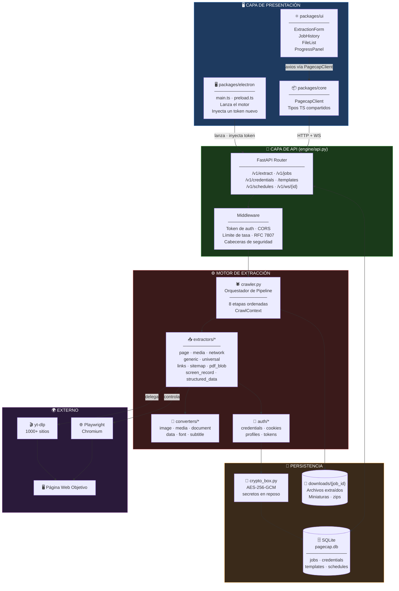
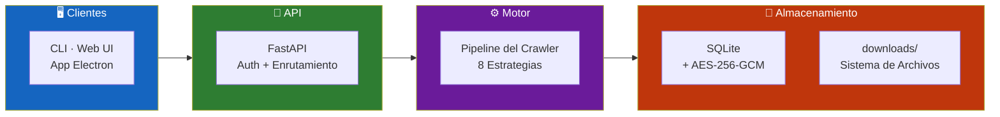
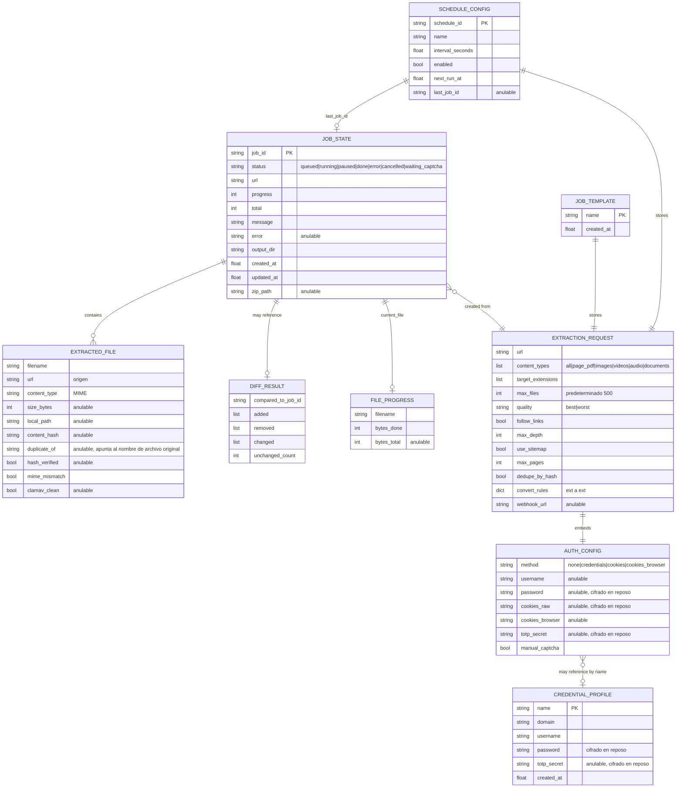
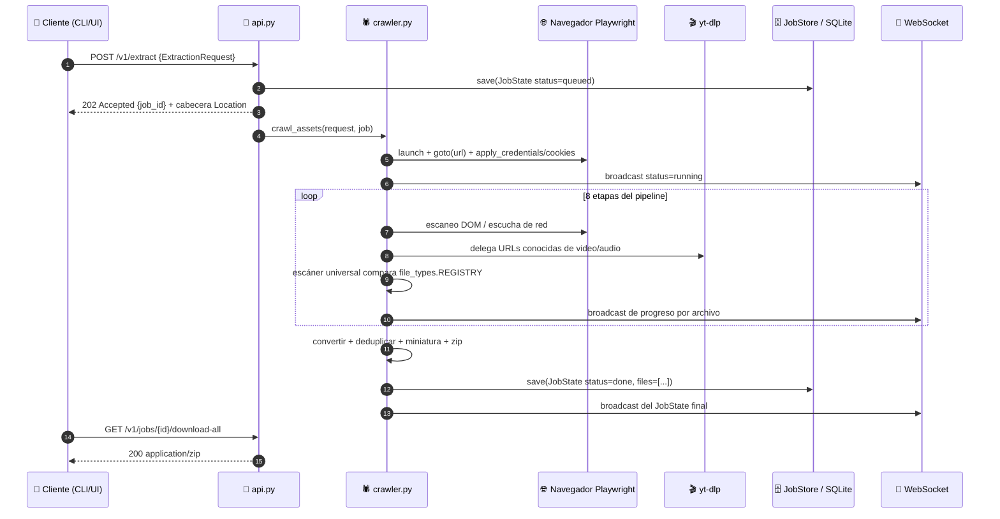
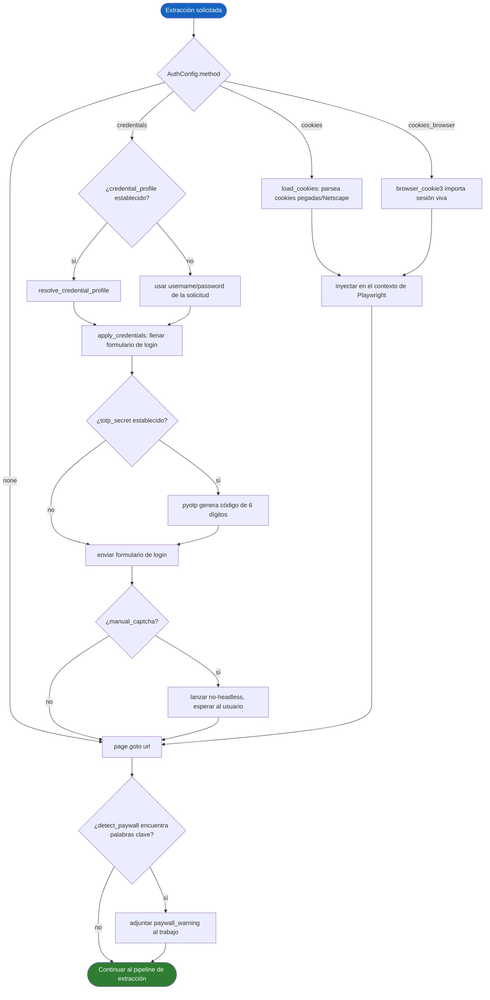
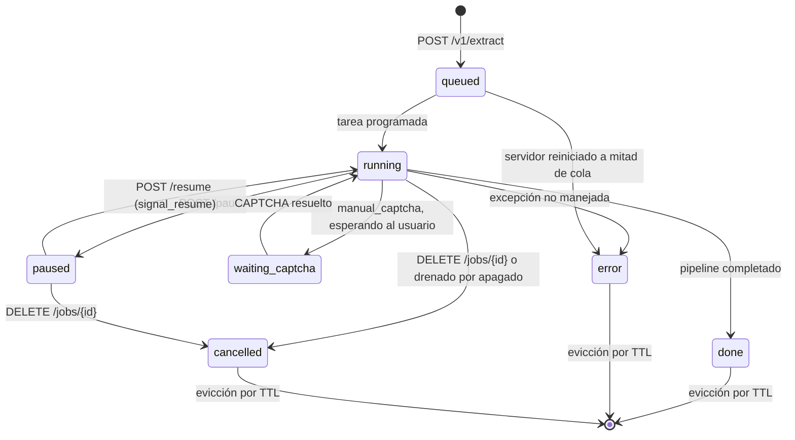
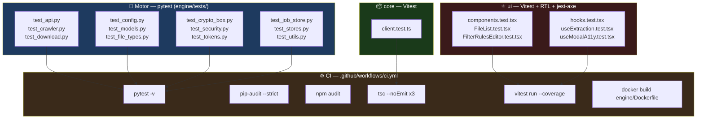

<div align="center">

**🌐 Choose Language / Selecione o Idioma / Elija el Idioma**

[](README.md)&nbsp;&nbsp;&nbsp;[](README_PT.md)&nbsp;&nbsp;&nbsp;[](README_ES.md)

</div>

---

<div align="center">

```
██████╗  █████╗  ██████╗ ███████╗ ██████╗ █████╗ ██████╗
██╔══██╗██╔══██╗██╔════╝ ██╔════╝██╔════╝██╔══██╗██╔══██╗
██████╔╝███████║██║  ███╗█████╗  ██║     ███████║██████╔╝
██╔═══╝ ██╔══██║██║   ██║██╔══╝  ██║     ██╔══██║██╔═══╝
██║     ██║  ██║╚██████╔╝███████╗╚██████╗██║  ██║██║
╚═╝     ╚═╝  ╚═╝ ╚═════╝ ╚══════╝ ╚═════╝╚═╝  ╚═╝╚═╝
        Extrae Cualquier Contenido de Cualquier Página Web
```

---

[](https://www.python.org/)
[](https://fastapi.tiangolo.com/)
[](https://playwright.dev/)
[](https://www.typescriptlang.org/)
[](https://react.dev/)
[](https://www.electronjs.org/)
[](LICENSE)

<br/>

> **PageCap recorre una página web con un navegador real y extrae todo lo que hay en ella**
> imágenes, video, audio, documentos, o la página completa como PDF, a través de una CLI, una API REST/WebSocket, o una aplicación de escritorio.

<br/>


</div>

---

## 📑 Tabla de Contenidos

<details>
<summary>▶️ <strong>Haga clic para expandir / contraer esta sección</strong></summary>

<table>
<tr>
<td valign="top" width="50%">

**🏗️ Sistema**
- [Visión General](#-visión-general)
- [Arquitectura del Sistema](#️-arquitectura-del-sistema)
- [Stack Tecnológico](#️-stack-tecnológico)
- [Patrones de Diseño](#-patrones-de-diseño-aplicados)
- [Estructura del Proyecto](#-estructura-del-proyecto)

**📦 Módulos**
- [api.py — Servidor HTTP/WebSocket](#-apipy--servidor-httpwebsocket)
- [cli.py — Interfaz de Línea de Comandos](#-clipy--interfaz-de-línea-de-comandos)
- [extractors/crawler.py — Orquestador de Pipeline](#️-extractorscrawlerpy--orquestador-de-pipeline)
- [extractors/ — Estrategias de Extracción](#-extractors--estrategias-de-extracción)
- [converters/ — Conversión Post-Descarga](#-converters--conversión-post-descarga)
- [auth/ — Credenciales, Cookies, Tokens](#-auth--credenciales-cookies-tokens)
- [job_store.py & stores.py — Persistencia](#-job_storepy--storespy--persistencia)
- [crypto_box.py — Cifrado de Secretos](#-crypto_boxpy--cifrado-de-secretos)
- [security.py & paywall.py — Seguridad de Contenido](#-securitypy--paywallpy--seguridad-de-contenido)
- [packages/core — Cliente TypeScript](#-packagescore--cliente-typescript)
- [packages/ui — Interfaz Web en React](#️-packagesui--interfaz-web-en-react)
- [packages/electron — Envoltorio de Escritorio](#️-packageselectron--envoltorio-de-escritorio)

</td>
<td valign="top" width="50%">

**💼 Negocio**
- [Reglas de Negocio](#-reglas-de-negocio)
- [Requisitos Funcionales](#-requisitos-funcionales)
- [Requisitos No Funcionales](#-requisitos-no-funcionales)

**📐 Diseño**
- [Modelo de Datos](#️-modelo-de-datos)
- [Flujos del Sistema](#-flujos-del-sistema)
- [Flujo del Trabajo de Extracción](#flujo-del-trabajo-de-extracción)
- [Flujo de Autenticación](#flujo-de-autenticación)
- [Pausar / Reanudar / Cancelar](#máquina-de-estados-del-ciclo-de-vida-del-trabajo)

**🔐 Seguridad y Operaciones**
- [Seguridad](#-seguridad)
- [Instalación & Ejecución](#-instalación--ejecución)
- [Pruebas Automatizadas](#-pruebas-automatizadas)
- [Métricas & Monitoreo](#-métricas--monitoreo)
- [Limitaciones Conocidas](#️-limitaciones-conocidas)

</td>
</tr>
</table>

---

</details>

## 🌟 Visión General

<details>
<summary>▶️ <strong>Haga clic para expandir / contraer esta sección</strong></summary>

**PageCap** es un kit de herramientas de extracción de contenido construido alrededor de un motor en Python que dirige un navegador Playwright real contra cualquier URL y extrae lo que sea que haya en la página: imágenes, videos, audio, PDFs, documentos ofimáticos, fuentes, subtítulos, archivos comprimidos, y más, a través de un registro de más de 150 tipos de archivo reconocidos (`engine/file_types.py`). Se expone de tres formas: una CLI basada en Typer (`engine/cli.py`) para scripting y trabajos puntuales, un servidor FastAPI REST + WebSocket (`engine/api.py`) para clientes programáticos y de UI, y una aplicación de escritorio React + Electron (`packages/ui`, `packages/electron`) que se comunica con ese mismo servidor como un proceso local.

El motor de extracción no es un único scraper sino un pipeline ordenado de estrategias independientes (`engine/extractors/crawler.py`): una captura de página a PDF, `yt-dlp` para los más de 1000 sitios que entiende de forma nativa, interceptación cruda de solicitudes de red para streams HLS/DASH y reproductores personalizados, un escaneo del DOM para etiquetas directas ``/`<video>`/`<audio>` y archivos enlazados, un escáner universal que compara cada extensión registrada contra el DOM y el tráfico de red observado, un rastreo recursivo opcional del mismo dominio (siguiendo enlaces o guiado por sitemap), una etapa de plugins para extractores provistos por el usuario, y, como último recurso, grabación de pantalla de lo que sea que se renderice en ella. Todo lo descargado puede convertirse opcionalmente a otro formato, deduplicarse por hash de contenido, generar miniaturas, verificarse por MIME, y comprimirse en zip, y cada trabajo se rastrea como estado duradero en SQLite para que el progreso sobreviva a un reinicio del servidor.

PageCap trata la API HTTP local como un límite de confianza real en lugar de un detalle de implementación: la autenticación es obligatoria por defecto (se genera un token en el primer arranque si no hay ninguno configurado), CORS está restringido a `localhost`/`127.0.0.1` más excepciones explícitas, los secretos (contraseñas de sitios, semillas TOTP, cookies crudas) se cifran en reposo con AES-256-GCM, y cada respuesta sigue el formato de detalles de problema RFC 7807 con un `X-Request-ID` que se conecta con los logs JSON estructurados. Dos ADRs (`docs/adr/`) documentan por qué: el ADR-001 explica que `127.0.0.1` es alcanzable por cualquier página web que el usuario visite y por lo tanto no es un límite de confianza por sí solo, y el ADR-002 explica por qué cada ruta se monta bajo `/v1` mientras las rutas heredadas sin versión se mantienen vivas pero marcadas con `Deprecation`/`Sunset`.

### 🎯 Objetivos del Sistema

| Objetivo | Descripción |
|-----------|-------------|
| 🌐 **Extracción universal** | Reconocer y descargar más de 150 tipos de archivo entre imágenes, video, audio, documentos, fuentes, subtítulos, datos, archivos comprimidos, código, formatos 3D y de ML |
| 🎬 **Video/audio a escala** | Delegar en `yt-dlp` para más de 1000 plataformas conocidas, y recurrir a interceptación cruda de red para HLS/DASH y reproductores personalizados |
| 📄 **Captura de página completa** | Renderizar la página en un navegador real y exportarla como un único PDF vía el pipeline de impresión de Playwright |
| 🔐 **Autenticación de primer nivel** | Soportar usuario/contraseña, cookies pegadas, importación de cookies del navegador, 2FA TOTP, y resolución manual de CAPTCHA para contenido protegido |
| 🕸️ **Rastreo recursivo** | Seguir opcionalmente enlaces del mismo dominio o un sitemap para extraer de muchas páginas en un solo trabajo |
| 🔄 **Conversión y deduplicación** | Convertir archivos descargados a otro formato, descartar duplicados idénticos por hash de contenido, y generar miniaturas |
| 📡 **Progreso en vivo** | Transmitir el estado del trabajo, progreso de bytes por archivo, y diferencias contra una ejecución anterior vía WebSocket |
| 🖥️ **Tres superficies, un motor** | La CLI, la API REST/WebSocket, y una app de escritorio Electron impulsan exactamente el mismo pipeline de extracción |
| 🔒 **Seguro por defecto** | Tokens de API, secretos cifrados, errores RFC 7807, limitación de tasa, verificación MIME y escaneo opcional con ClamAV |

---

</details>

## 🏗️ Arquitectura del Sistema

<details>
<summary>▶️ <strong>Haga clic para expandir / contraer esta sección</strong></summary>

### Diagrama de Módulos



### Capas de la Arquitectura



---

</details>

## 🛠️ Stack Tecnológico

<details>
<summary>▶️ <strong>Haga clic para expandir / contraer esta sección</strong></summary>

<table>
<thead>
<tr>
<th>Capa</th>
<th>Tecnología</th>
<th>Versión</th>
<th>Propósito</th>
</tr>
</thead>
<tbody>
<tr>
<td rowspan="4"><strong>🐍 Núcleo del Motor</strong></td>
<td>Python</td>
<td>3.10+</td>
<td>Lenguaje del motor de extracción</td>
</tr>
<tr>
<td>FastAPI</td>
<td>0.115+</td>
<td>Servidor REST + WebSocket (<code>engine/api.py</code>)</td>
</tr>
<tr>
<td>Uvicorn</td>
<td>0.30+</td>
<td>Servidor ASGI (<code>uvicorn[standard]</code>)</td>
</tr>
<tr>
<td>Pydantic</td>
<td>2.9+</td>
<td>Modelos de solicitud/respuesta (<code>engine/models.py</code>)</td>
</tr>
<tr>
<td rowspan="3"><strong>🌐 Navegador y Medios</strong></td>
<td>Playwright</td>
<td>1.47+</td>
<td>Automatización de Chromium headless/headful, página→PDF</td>
</tr>
<tr>
<td>yt-dlp</td>
<td>2024.9+</td>
<td>Descarga de video/audio en más de 1000 sitios</td>
</tr>
<tr>
<td>httpx</td>
<td>0.27+</td>
<td>Descargas HTTP asíncronas, obtención de sitemaps</td>
</tr>
<tr>
<td rowspan="2"><strong>💻 CLI</strong></td>
<td>Typer</td>
<td>0.12+</td>
<td><code>engine/cli.py</code> — comandos <code>extract</code>, <code>server</code>, <code>token</code></td>
</tr>
<tr>
<td>Rich</td>
<td>13.8+</td>
<td>Barras de progreso, tablas, salida de consola coloreada</td>
</tr>
<tr>
<td rowspan="2"><strong>🔐 Auth</strong></td>
<td>browser-cookie3</td>
<td>0.19+</td>
<td>Importa cookies vivas desde Chrome/Firefox/Edge/Brave/Opera/Safari</td>
</tr>
<tr>
<td>pyotp / cryptography</td>
<td>2.9+ / 43.0+</td>
<td>Códigos 2FA TOTP · cifrado de secretos AES-256-GCM</td>
</tr>
<tr>
<td rowspan="5"><strong>🔁 Conversión</strong></td>
<td>Pillow + pillow-heif + pillow-avif-plugin</td>
<td>10.4+ / 0.18+ / 1.4+</td>
<td>Conversión de imágenes incl. HEIC/HEIF y AVIF</td>
</tr>
<tr>
<td>cairosvg / rawpy</td>
<td>2.7+ / 0.23+</td>
<td>SVG → PNG/PDF · RAW de cámara (CR2, NEF, ARW…)</td>
</tr>
<tr>
<td>pandas / openpyxl / odfpy / pyarrow / fastavro</td>
<td>2.2+ / 3.1+ / 1.4+ / 17.0+ / 1.9+</td>
<td>Conversión tabular: CSV, XLSX, ODS, Parquet, Avro</td>
</tr>
<tr>
<td>fonttools / brotli</td>
<td>4.53+ / 1.1+</td>
<td>Conversión de formato de fuentes + compresión WOFF2</td>
</tr>
<tr>
<td>pysubs2 / pdfminer.six</td>
<td>1.7+ / 20221105+</td>
<td>Conversión de subtítulos · extracción de texto de PDF de respaldo</td>
</tr>
<tr>
<td rowspan="4"><strong>⚛️ UI Web</strong></td>
<td>React</td>
<td>18.3</td>
<td><code>packages/ui</code> — árbol de componentes</td>
</tr>
<tr>
<td>Vite</td>
<td>8.1</td>
<td>Servidor de desarrollo + build</td>
</tr>
<tr>
<td>TypeScript</td>
<td>5.6</td>
<td>Compartido entre los tres workspaces de npm</td>
</tr>
<tr>
<td>lucide-react</td>
<td>0.441+</td>
<td>Conjunto de íconos</td>
</tr>
<tr>
<td rowspan="2"><strong>🖥️ Escritorio</strong></td>
<td>Electron</td>
<td>43</td>
<td><code>packages/electron</code> — lanza el motor, inyecta un token</td>
</tr>
<tr>
<td>electron-builder</td>
<td>26.15+</td>
<td>Empaquetado NSIS (Windows) / DMG (macOS) / AppImage (Linux)</td>
</tr>
<tr>
<td rowspan="2"><strong>📦 Cliente Compartido</strong></td>
<td>axios</td>
<td>1.7+</td>
<td><code>packages/core</code> — wrapper HTTP <code>PagecapClient</code></td>
</tr>
<tr>
<td>vitest</td>
<td>4.1+</td>
<td>Pruebas unitarias para <code>core</code> y <code>ui</code></td>
</tr>
<tr>
<td rowspan="3"><strong>🧪 Pruebas y QA</strong></td>
<td>pytest</td>
<td>—</td>
<td>Suite de pruebas del motor (<code>engine/tests/</code>, <code>pytest.ini</code>)</td>
</tr>
<tr>
<td>@testing-library/react + jest-axe</td>
<td>16.3+ / 9.0+</td>
<td>Pruebas de componentes de UI + aserciones de accesibilidad</td>
</tr>
<tr>
<td>pip-audit / npm audit</td>
<td>—</td>
<td>Escaneo de vulnerabilidades de dependencias en CI</td>
</tr>
</tbody>
</table>

---

</details>

## 🎨 Patrones de Diseño Aplicados

<details>
<summary>▶️ <strong>Haga clic para expandir / contraer esta sección</strong></summary>

| Patrón | Dónde | Justificación |
|---------|-------|-----------|
| 🚏 **Pipeline / Chain of Responsibility** | `extractors/crawler.py` — lista de `_Stage` ejecutada en secuencia sobre un `CrawlContext` compartido | Añadir o reordenar una estrategia de extracción significa editar una lista, no una función de 400 líneas; cada etapa obtiene un manejo uniforme de cancelación/pausa de forma gratuita |
| 🧺 **Context Object** | dataclass `CrawlContext` | Agrupa ~15 piezas de estado compartido para que las etapas se conviertan en funciones testeables de forma independiente en lugar de closures |
| 🏭 **Registry** | `file_types.REGISTRY`, `_CT_TO_CATEGORIES` en `crawler.py` | Más de 150 tipos de archivo y sus objetivos de conversión se declaran como datos, buscados por extensión, no ramificados en código |
| 🔌 **Plugin / Punto de Extensión** | `plugins.py` — `load_plugins()` importa cualquier `extract()` en `PAGECAP_PLUGINS_DIR` | Se añaden etapas de extracción de terceros sin tocar el código central, aisladas para que un plugin roto no pueda colapsar un trabajo |
| 🎯 **Facade** | `auth/credentials.py::apply_credentials`, `auth/cookies.py::load_cookies` | Una llamada en cada caso oculta el llenado de formularios de Playwright, la generación de TOTP, y el parseo de jarras de cookies del navegador detrás de una firma simple |
| 🛡️ **Guardia de Fallo Cerrado** | `api.py::_is_authorized`, `_websocket_allowed` | Cada ruta excepto `/health*` se deniega a menos que se demuestre autorización; no hay rama de permitir-implícito |
| 🧊 **Configuración Inmutable** | `config.py::Settings` — `dataclass` congelada, leída una vez al importar | Evita el bug histórico donde `api.py` y `auth/profiles.py` cada uno leía `os.getenv` de forma independiente y podían discrepar |
| 🔁 **Strategy** | `converters/*.py` — un módulo por categoría de medios (imagen, documento, datos, fuente, subtítulo, medio) | La lógica de conversión varía completamente por familia de formato; cada convertidor se intercambia por los objetivos declarados en `can_convert_to` |
| 🌊 **Generador Async / Streaming** | Las funciones extractoras hacen `yield ExtractedFile` a medida que las encuentran | Los archivos aparecen en la UI tan pronto como se encuentran, no después de que toda la página termine de rastrearse |
| 🚦 **Drenado tipo Circuit-Breaker** | `api.py::_drain_jobs` al apagar | Los trabajos en curso obtienen una ventana de gracia acotada para terminar limpiamente en lugar de ser matados a mitad de escritura |

---

</details>

## 📁 Estructura del Proyecto

<details>
<summary>▶️ <strong>Haga clic para expandir / contraer esta sección</strong></summary>

```
PageCap/
│
├── 📄 package.json                    # Raíz de workspace npm: scripts dev/build/test para los 3 paquetes
├── 📄 package-lock.json
├── 📄 setup.bat / setup.sh            # Bootstrap de entorno de un solo paso (Windows / Unix)
├── 📄 .env.example                    # Cada variable de entorno PAGECAP_*, documentada
├── 📄 LICENSE                         # MIT
│
├── 📂 engine/                         # 🐍 Motor de extracción en Python
│   ├── 📄 api.py                      # Servidor FastAPI REST + WebSocket, ciclo de vida de trabajos, middleware
│   ├── 📄 cli.py                      # CLI Typer: comandos extract / server / token
│   ├── 📄 config.py                   # Dataclass Settings congelada — fuente única de configuración de entorno
│   ├── 📄 models.py                   # Modelos Pydantic: ExtractionRequest, JobState, etc.
│   ├── 📄 converter.py                # Despacha al módulo converters/* correcto según la extensión
│   ├── 📄 crypto_box.py               # Cifrado AES-256-GCM para secretos almacenados
│   ├── 📄 download.py                 # Descarga asíncrona por fragmentos con reintento, hash, progreso
│   ├── 📄 file_types.py               # Registro de más de 150 extensiones y tipos MIME reconocidos
│   ├── 📄 job_store.py                # Persistencia SQLite para JobState (sobrevive a reinicios)
│   ├── 📄 logging_config.py           # Logging JSON estructurado + contexto de request-id
│   ├── 📄 paywall.py                  # Detección heurística de texto de muro de pago/inicio de sesión
│   ├── 📄 plugins.py                  # Carga plugins extractores provistos por el usuario
│   ├── 📄 problem_details.py          # Respuestas de error RFC 7807
│   ├── 📄 security.py                 # Detección de MIME por bytes mágicos + escaneo opcional con ClamAV
│   ├── 📄 stores.py                   # Persistencia SQLite para credenciales/plantillas/programaciones
│   ├── 📄 thumbnails.py               # Generación de miniaturas para medios extraídos
│   ├── 📄 utils.py                    # Helpers compartidos
│   ├── 📄 requirements.txt            # Dependencias de Python en tiempo de ejecución
│   ├── 📄 requirements-dev.txt        # + pytest y herramientas de desarrollo
│   ├── 📄 pytest.ini                  # Configuración de pruebas
│   ├── 📄 Dockerfile                  # Imagen de contenedor del motor
│   │
│   ├── 📂 extractors/                 # Etapas del pipeline, una estrategia por módulo
│   │   ├── crawler.py                 # Orquestador: CrawlContext + lista ordenada de _Stage
│   │   ├── page.py                    # Captura Página → PDF (impresión de Playwright)
│   │   ├── media.py                   # Video/audio vía yt-dlp
│   │   ├── network.py                 # Interceptación cruda de red (HLS/DASH, reproductores personalizados)
│   │   ├── generic.py                 # Escaneo de DOM para /<video>/<audio> y archivos enlazados
│   │   ├── universal.py               # Compara los más de 150 tipos registrados contra DOM + red
│   │   ├── links.py                   # Descubrimiento de enlaces del mismo dominio para rastreo recursivo
│   │   ├── sitemap.py                 # Descubrimiento de URLs guiado por sitemap.xml
│   │   ├── pdf_blob.py                # Extrae PDFs servidos como blobs en la página
│   │   ├── screen_record.py           # Respaldo de grabación de pantalla de último recurso
│   │   └── structured_data.py         # Extracción de JSON-LD / microdatos, exportación a CSV
│   │
│   ├── 📂 converters/                 # Conversión de formato post-descarga, un módulo por familia
│   │   ├── image.py                   # Conversiones JPG/PNG/WebP/AVIF/HEIC/SVG/RAW
│   │   ├── document.py                # Conversiones Texto/Word/ODT/PDF/EPUB
│   │   ├── data.py                    # Conversiones CSV/XLSX/ODS/Parquet/Avro
│   │   ├── media.py                   # Recodificación de audio/video
│   │   ├── font.py                    # Conversiones de formato de fuente + WOFF2
│   │   └── subtitle.py                # Conversiones de formato de subtítulos
│   │
│   ├── 📂 auth/                       # Autenticación para la página web objetivo (no la API)
│   │   ├── credentials.py             # Llenado automatizado de formulario de inicio de sesión vía Playwright
│   │   ├── cookies.py                 # Parsea cookies pegadas / archivos de cookies Netscape
│   │   ├── profiles.py                # Resuelve un CredentialProfile guardado por nombre
│   │   └── tokens.py                  # Genera/persiste el token bearer de la API de PageCap
│   │
│   └── 📂 tests/                      # suite pytest — ver sección Pruebas Automatizadas
│       ├── test_api.py · test_config.py · test_crawler.py · test_crypto_box.py
│       ├── test_download.py · test_file_types.py · test_job_store.py · test_models.py
│       └── test_security.py · test_stores.py · test_tokens.py · test_utils.py
│
├── 📂 packages/                       # Workspaces npm de TypeScript
│   ├── 📂 core/                       # @pagecap/core — tipos compartidos + cliente HTTP/WS
│   │   └── src/
│   │       ├── client.ts              # PagecapClient (basado en axios)
│   │       ├── client.test.ts
│   │       ├── types.ts               # ExtractionRequest, JobState, etc. reflejando models.py
│   │       └── index.ts
│   │
│   ├── 📂 ui/                         # @pagecap/ui — interfaz web React + Vite
│   │   └── src/
│   │       ├── App.tsx                # Componente raíz, conexión de tema/idioma
│   │       ├── apiClient.ts           # Envuelve @pagecap/core para el build del navegador
│   │       ├── i18n.ts                # Traducciones de la UI
│   │       ├── format.ts / notify.ts  # Helpers de formato, notificaciones toast
│   │       ├── components/            # ExtractionForm, FileList, JobHistory,
│   │       │                          # FilterRulesEditor, ProgressPanel, Theme/LanguageToggle
│   │       ├── hooks/                 # useExtraction, useTheme, useModalA11y, useKeyboardShortcuts
│   │       └── test/                  # Setup de RTL, arnés de accesibilidad jest-axe
│   │
│   └── 📂 electron/                   # @pagecap/electron — envoltorio de escritorio
│       └── src/
│           ├── main.ts                # Lanza el motor Python, genera un token por lanzamiento
│           └── preload.ts             # Puente IPC seguro hacia el renderer
│
├── 📂 docs/adr/                       # Registros de Decisiones de Arquitectura
│   ├── ADR-001-local-api-trust-boundary.md   # Por qué loopback ≠ límite de confianza, auth por token
│   └── ADR-002-api-versioning.md             # Por qué cada ruta vive bajo /v1
│
├── 📂 .github/workflows/              # CI: pytest, pip-audit, npm audit, typecheck,
│   └── ci.yml                         # Vitest + gate de cobertura, 3 builds, build de imagen Docker
│
├── 📄 README.md                       # 🇺🇸 Inglés (primario)
├── 📄 README_PT.md                    # 🇧🇷 Português
└── 📄 README_ES.md                    # 🇪🇸 Español
```

---

</details>

## 📦 Módulos del Sistema

<details>
<summary>▶️ <strong>Haga clic para expandir / contraer esta sección</strong></summary>

### 🚏 `api.py` — Servidor HTTP/WebSocket

Aplicación FastAPI que expone el motor sobre REST y WebSocket. Monta cada ruta dos veces, una bajo `/v1` (canónica) y otra en la raíz (`include_in_schema=False`, marcada `Deprecation`/`Sunset` según el ADR-002).

| Responsabilidad | Implementación |
|-----------------|-----------------|
| Ciclo de vida del trabajo | `POST /v1/extract`, `GET /v1/jobs/{id}`, `DELETE /v1/jobs/{id}`, `/pause`, `/resume` |
| Acceso a archivos | `/v1/jobs/{id}/files`, `/download/{filename}`, `/preview/{filename}` (verificación de MIME segura para inline), `/download-all` (zip) |
| Progreso en vivo | `/v1/ws/{job_id}` — envía el `JobState` completo en JSON al conectar y después de cada cambio de estado |
| Presets | `/v1/credentials`, `/v1/templates`, `/v1/schedules` — paquetes de `ExtractionRequest` guardados |
| Salud y métricas | `/health`, `/health/live`, `/health/ready` (sin autenticación), `/v1/metrics` (métricas RED con percentiles) |
| Middleware de auth | Token bearer o parámetro de consulta `?token=`, comparación en tiempo constante vía `hmac.compare_digest` |
| Limitación de tasa | Ventana deslizante de 60s por IP, `PAGECAP_RATE_LIMIT_PER_MINUTE` (0 = deshabilitado) |
| Bucles de fondo | `_eviction_loop` (limpieza por TTL), `_scheduler_loop` (dispara filas de `ScheduleConfig` vencidas) |
| Apagado ordenado | `_drain_jobs` cancela los trabajos en ejecución cooperativamente dentro de `PAGECAP_SHUTDOWN_DRAIN_SECONDS` |

---

### 💻 `cli.py` — Interfaz de Línea de Comandos

Aplicación Typer con tres comandos, construida sobre el mismo pipeline `crawl_assets` que usa el servidor.

| Comando | Propósito | Opciones clave |
|---------|---------|-------------|
| `extract` | Ejecuta un trabajo de extracción hasta completarlo, imprimiendo una barra de progreso Rich y una tabla de resultados | `--type`, `--username/--password`, `--cookies`, `--browser`, `--convert`, `--follow-links`, `--json` |
| `server` | Inicia el servidor FastAPI (`uvicorn api:app`) | `--host`, `--port`, `--reload` |
| `token` | Imprime (o genera) el token bearer de la API que el servidor en ejecución exige | `--show` |

---

### 🕷️ `extractors/crawler.py` — Orquestador de Pipeline

El corazón del motor. `crawl_assets(request, job, on_progress)` ejecuta 8 etapas ordenadas sobre una dataclass `CrawlContext` compartida, cada etapa un nombre más un invocable async, de modo que el pipeline es datos en lugar de una función de control de flujo monolítica. Después de todas las etapas: conversión, generación de miniaturas, diferencia contra el trabajo anterior para la misma URL, empaquetado en zip, y notificación por webhook.

| # | Etapa | Archivo | Se ejecuta cuando |
|---|-------|------|-----------|
| 1 | Página → PDF | `page.py` | `content_types` incluye `page_pdf` |
| 2 | Descarga con yt-dlp | `media.py` | `want_media` y la URL/página coincide con una plataforma conocida |
| 3 | Interceptación de red | `network.py` | `want_media`, para HLS/DASH y reproductores personalizados que yt-dlp no puede resolver |
| 4 | Escaneo del DOM | `generic.py` | Siempre, para etiquetas directas ``/`<video>`/`<audio>` y archivos enlazados |
| 5 | Escáner universal | `universal.py` | Siempre, compara cada extensión de `file_types.REGISTRY` contra DOM + red |
| 6 | Rastreo recursivo | `links.py`, `sitemap.py` | Se establece `follow_links` o `use_sitemap` |
| 7 | Plugins | `plugins.py` | Cualquier `*.py` en `PAGECAP_PLUGINS_DIR` que exponga `extract()` |
| 8 | Grabación de pantalla | `screen_record.py` | Se establece `screen_record`, como respaldo para contenido protegido |

`pdf_blob.py` extrae PDFs que la página construye como blobs en memoria en lugar de servirlos como una URL (integrado en la etapa 5); `structured_data.py` extrae JSON-LD/microdatos y puede exportarlos a CSV (`export_structured_data_csv`).

---

### 🔁 `converters/` — Conversión Post-Descarga

Invocado por `converter.py`, que enruta un archivo descargado al módulo correcto según su extensión objetivo, verificada contra `FileTypeInfo.can_convert_to` en `file_types.py`.

| Módulo | Maneja |
|--------|---------|
| `image.py` | JPG/PNG/GIF/WebP/AVIF/HEIC/TIFF/SVG/RAW vía Pillow, pillow-heif, pillow-avif-plugin, cairosvg, rawpy |
| `document.py` | Conversiones TXT/MD/RTF/DOC/DOCX/ODT/PDF/EPUB (pipelines de texto estilo pandoc, respaldo pdfminer.six) |
| `data.py` | CSV/TSV/XLSX/ODS/JSON/Parquet/Avro vía pandas, openpyxl, odfpy, pyarrow, fastavro |
| `media.py` | Recodificación de audio/video |
| `font.py` | Conversión de formato de fuente y compresión WOFF2 vía fonttools + brotli |
| `subtitle.py` | Conversión de formato de subtítulos vía pysubs2 |

---

### 🔑 `auth/`, `job_store.py`, `stores.py`, `crypto_box.py`, `security.py`, `paywall.py`

`auth/` maneja dos tipos distintos de autenticación: iniciar sesión en el **sitio objetivo** del que se extrae, y el propio token bearer de la **API de PageCap**.

| Archivo | Rol |
|------|------|
| `auth/credentials.py` | `apply_credentials()` — llenado automatizado de formulario de inicio de sesión vía Playwright, incluyendo generación de código TOTP a partir de un secreto guardado |
| `auth/cookies.py` | `load_cookies()` — parsea cadenas de cookies pegadas, archivos de cookies Netscape, o importa cookies vivas vía `browser-cookie3` |
| `auth/profiles.py` | `resolve_credential_profile()` — busca un `CredentialProfile` guardado por nombre |
| `auth/tokens.py` | `resolve_api_token()` — genera y persiste el propio token bearer de la API en `.pagecap_token` |
| `job_store.py` | Filas de `JobState` en SQLite (tabla `jobs`); los trabajos `ACTIVE` al arrancar se marcan `error` ya que su tarea en proceso desapareció |
| `stores.py` | `CredentialProfile`, `JobTemplate`, `ScheduleConfig` — presets reutilizables, cada uno un blob JSON indexado por nombre |
| `crypto_box.py` | `SecretBox` cifra contraseñas/secretos TOTP/cookies crudas con AES-256-GCM antes de que `stores.py` las escriba; clave desde `PAGECAP_SECRET_KEY` o un `.pagecap_key` generado (0600); las filas heredadas en texto plano aún se descifran y recifran de forma transparente |
| `security.py` | `sniff_category()`/`verify_mime()` marcan una discrepancia de bytes mágicos contra la extensión declarada; `clamav_scan()` ejecuta un binario ClamAV instalado localmente si está presente |
| `paywall.py` | `detect_paywall()` escanea el texto visible de la página en busca de frases de muro de pago/inicio de sesión y adjunta una advertencia en lugar de bloquear la extracción |

---

### 📦 `packages/core`, ⚛️ `packages/ui`, 🖥️ `packages/electron`

`@pagecap/core` es el contrato compartido entre la UI web y Electron: `types.ts` refleja cada modelo Pydantic en `engine/models.py`, y `client.ts` exporta `PagecapClient`, un wrapper basado en axios para cada endpoint REST más helpers de WebSocket.

`@pagecap/ui` es una app de una sola página con Vite + React 18. `ExtractionForm` construye un `ExtractionRequest`, `ProgressPanel` renderiza actualizaciones en vivo de WebSocket, `FileList` muestra y previsualiza archivos extraídos, `JobHistory` lista trabajos pasados, y `FilterRulesEditor` configura el filtrado por extensión/dominio. `useTheme` y `LanguageToggle` proveen cambio de tema claro/oscuro e i18n; `useModalA11y` y la suite jest-axe mantienen los diálogos accesibles.

`main.ts` de `@pagecap/electron` lanza el motor Python como un proceso hijo al iniciar la app, genera un token de API aleatorio nuevo por cada lanzamiento, y lo inyecta en el renderer a través de un puente IPC `preload.ts`. Se empaqueta vía `electron-builder` (NSIS/DMG/AppImage), incluyendo `packages/ui/dist` y `engine/` como recurso extra.

---

</details>

## 💼 Reglas de Negocio

<details>
<summary>▶️ <strong>Haga clic para expandir / contraer esta sección</strong></summary>

### 🕷️ Reglas de Extracción

| # | Regla | Cumplimiento |
|---|------|-------------|
| RN-01 | Cada extracción apunta a una URL principal, opcionalmente con `additional_urls` agrupadas en el mismo trabajo | `ExtractionRequest.url` + `.additional_urls` |
| RN-02 | Un trabajo nunca devuelve más de `max_files` archivos extraídos (predeterminado 500) | Aplicado durante el bucle de rastreo en `crawler.py` |
| RN-03 | El rastreo recursivo solo sigue enlaces del mismo dominio que la URL semilla | `extractors/links.py::discover_same_domain_links` |
| RN-04 | El rastreo recursivo está acotado tanto por `max_depth` como por `max_pages` | Verificado antes de cada obtención de página adicional |
| RN-05 | Los archivos por debajo de `min_file_size_bytes` o por encima de `max_file_size_bytes` se omiten | Aplicado en la etapa de descarga |
| RN-06 | Un trabajo se aborta una vez que los bytes totales descargados excederían `max_job_size_bytes` (si está establecido) | Verificado antes de cada descarga de archivo |
| RN-07 | Los dominios en `blocked_domains` nunca se obtienen, incluso si se descubren al rastrear | Verificado en la capa de red/descarga |
| RN-08 | Cuando `dedupe_by_hash` es verdadero, los archivos idénticos en bytes se registran una vez con `duplicate_of` apuntando al original | Comparación de hash de contenido durante la descarga |

### 🔐 Reglas de Autenticación

| # | Regla | Cumplimiento |
|---|------|-------------|
| RN-09 | Exactamente un método de auth aplica por trabajo: ninguno, credenciales, cookies pegadas, o cookies importadas del navegador | `AuthConfig.method` |
| RN-10 | `manual_captcha=true` fuerza al navegador a lanzarse visiblemente (no headless) sin importar el ajuste `headless` | Lógica de lanzamiento de navegador en `crawler.py` |
| RN-11 | Una referencia `credential_profile` se resuelve a un perfil guardado; la solicitud nunca tiene que llevar la contraseña en línea | `auth/profiles.py::resolve_credential_profile` |
| RN-12 | Las contraseñas, secretos TOTP y cookies crudas almacenadas siempre se cifran antes de escribirse en SQLite | `crypto_box.SecretBox` usado dentro de `stores.py` |

### 🔑 Reglas de Acceso a la API

| # | Regla | Cumplimiento |
|---|------|-------------|
| RN-13 | Cada ruta excepto `/health`, `/health/live`, `/health/ready` requiere un token bearer válido a menos que la auth esté explícitamente deshabilitada | `api.py::_is_authorized`, `_UNAUTHENTICATED_PATHS` |
| RN-14 | `GET /templates` y `GET /schedules` nunca devuelven `password`/`totp_secret`/`cookies_raw` | `models.PUBLIC_EXCLUDE` aplicado vía `model_dump(exclude=...)` |
| RN-15 | `GET /credentials` nunca devuelve la contraseña almacenada ni el secreto TOTP, nunca | `exclude={"password","totp_secret"}` explícito |
| RN-16 | La fila de BD de un trabajo cancelado se conserva (no se elimina) para que su historial permanezca inspeccionable; solo la evicción por TTL lo elimina | `DELETE /v1/jobs/{id}` establece el estado, no elimina la fila |

---

</details>

## ✅ Requisitos Funcionales

<details>
<summary>▶️ <strong>Haga clic para expandir / contraer esta sección</strong></summary>

| ID | Requisito | Prioridad | Estado |
|----|-------------|----------|--------|
| **RF-01** | El sistema debe extraer imágenes, videos, audio y documentos de una URL dada | 🔴 Alta | ✅ Implementado |
| **RF-02** | El sistema debe renderizar la página objetivo y exportarla como un único PDF | 🔴 Alta | ✅ Implementado |
| **RF-03** | El sistema debe descargar video/audio vía yt-dlp para las plataformas que reconoce | 🔴 Alta | ✅ Implementado |
| **RF-04** | El sistema debe interceptar solicitudes de red crudas para capturar streams que yt-dlp no puede resolver | 🟡 Media | ✅ Implementado |
| **RF-05** | El sistema debe reconocer más de 150 extensiones de archivo y sus tipos MIME | 🔴 Alta | ✅ Implementado |
| **RF-06** | El sistema debe soportar el inicio de sesión vía usuario/contraseña en el sitio objetivo | 🔴 Alta | ✅ Implementado |
| **RF-07** | El sistema debe soportar cookies pegadas y cookies importadas de un navegador instalado | 🔴 Alta | ✅ Implementado |
| **RF-08** | El sistema debe soportar 2FA basado en TOTP durante el inicio de sesión automatizado | 🟡 Media | ✅ Implementado |
| **RF-09** | El sistema debe soportar la resolución manual de CAPTCHA lanzando un navegador visible | 🟡 Media | ✅ Implementado |
| **RF-10** | El sistema debe seguir opcionalmente enlaces del mismo dominio de forma recursiva, acotado por profundidad y cantidad de páginas | 🟡 Media | ✅ Implementado |
| **RF-11** | El sistema debe descubrir opcionalmente URLs vía `sitemap.xml` | 🟢 Baja | ✅ Implementado |
| **RF-12** | El sistema debe convertir archivos descargados a un formato objetivo solicitado | 🟡 Media | ✅ Implementado |
| **RF-13** | El sistema debe deduplicar archivos descargados por hash de contenido | 🟡 Media | ✅ Implementado |
| **RF-14** | El sistema debe generar miniaturas para medios extraídos bajo solicitud | 🟢 Baja | ✅ Implementado |
| **RF-15** | El sistema debe reportar progreso en vivo incluyendo conteos de bytes por archivo vía WebSocket | 🔴 Alta | ✅ Implementado |
| **RF-16** | El sistema debe permitir pausar, reanudar y cancelar un trabajo en ejecución | 🟡 Media | ✅ Implementado |
| **RF-17** | El sistema debe comparar los archivos de un trabajo contra la ejecución previa más reciente de la misma URL | 🟢 Baja | ✅ Implementado |
| **RF-18** | El sistema debe persistir el historial de trabajos en SQLite para que sobreviva a un reinicio del servidor | 🔴 Alta | ✅ Implementado |
| **RF-19** | El sistema debe soportar perfiles de credenciales guardados, plantillas de trabajo, y programaciones recurrentes | 🟡 Media | ✅ Implementado |
| **RF-20** | El sistema debe detectar y advertir sobre contenido probablemente detrás de un muro de pago/inicio de sesión | 🟢 Baja | ✅ Implementado |
| **RF-21** | El sistema debe verificar opcionalmente los bytes mágicos de cada archivo contra su tipo MIME declarado | 🟡 Media | ✅ Implementado |
| **RF-22** | El sistema debe escanear opcionalmente los archivos descargados con un ClamAV instalado localmente | 🟢 Baja | ✅ Implementado |
| **RF-23** | El sistema debe exponer todo lo anterior a través de una CLI, una API REST/WebSocket, y una app de escritorio | 🔴 Alta | ✅ Implementado |

---

</details>

## ⚡ Requisitos No Funcionales

<details>
<summary>▶️ <strong>Haga clic para expandir / contraer esta sección</strong></summary>

| ID | Categoría | Requisito | Objetivo |
|----|----------|-------------|--------|
| **RNF-01** | ⚡ Rendimiento | Descargas de archivo concurrentes dentro de un trabajo | `download_concurrency` (predeterminado 6) |
| **RNF-02** | ⚡ Rendimiento | Limitación de la difusión de progreso a nivel de byte | ≤ 4 mensajes/segundo por archivo (`emit_file_progress`) |
| **RNF-03** | 🔁 Confiabilidad | Descargas fallidas reintentadas automáticamente | `download_retries` (predeterminado 2) |
| **RNF-04** | 🔁 Confiabilidad | Los trabajos en curso sobreviven a un fallo en proceso de una etapa | Cada etapa envuelta de forma independiente; el trabajo continúa a la siguiente etapa |
| **RNF-05** | 🔁 Confiabilidad | El apagado ordenado drena los trabajos en ejecución en lugar de matarlos | `PAGECAP_SHUTDOWN_DRAIN_SECONDS` (predeterminado 20s) |
| **RNF-06** | 🔐 Seguridad | Autenticación de API requerida por defecto | Token generado en el primer arranque si no está definido (ADR-001) |
| **RNF-07** | 🔐 Seguridad | Acceso de origen cruzado restringido a loopback + orígenes explícitos | `allow_origin_regex`, `PAGECAP_CORS_ORIGINS` |
| **RNF-08** | 🔐 Seguridad | Secretos cifrados en reposo | AES-256-GCM vía `crypto_box.py` |
| **RNF-09** | 🔐 Seguridad | Cada respuesta lleva cabeceras de seguridad básicas | `X-Content-Type-Options`, `CSP`, `Referrer-Policy`, `X-Frame-Options` |
| **RNF-10** | 🔐 Seguridad | Limitación de tasa disponible por IP de cliente | `PAGECAP_RATE_LIMIT_PER_MINUTE`, 0 = deshabilitado |
| **RNF-11** | 📈 Escalabilidad | El listado de trabajos permanece O(1) por página sin importar el tamaño del historial | Paginación por cursor/keyset en `GET /v1/jobs` |
| **RNF-12** | 📈 Escalabilidad | Los datos de trabajos antiguos no se acumulan indefinidamente | Barrido de evicción por TTL, predeterminado 3 días |
| **RNF-13** | 👁️ Observabilidad | Cada solicitud rastreable de extremo a extremo | Cabecera `X-Request-ID` ↔ campo de log JSON estructurado |
| **RNF-14** | 👁️ Observabilidad | Métricas RED disponibles para la superficie de la API | `GET /v1/metrics` con latencia p50/p95/p99/p99.9 |
| **RNF-15** | ♿ Accesibilidad | Los diálogos de la UI web son navegables por teclado y lector de pantalla | Hook `useModalA11y` + aserciones jest-axe en CI |
| **RNF-16** | 🧩 Compatibilidad | Las respuestas de la API permanecen aditivas dentro de una versión | Versionado `/v1`, `Deprecation`/`Sunset` en rutas heredadas (ADR-002) |

---

</details>

## 🗄️ Modelo de Datos

<details>
<summary>▶️ <strong>Haga clic para expandir / contraer esta sección</strong></summary>

PageCap no tiene un esquema relacional en el sentido tradicional: SQLite almacena cada `JobState`, `CredentialProfile`, `JobTemplate`, y `ScheduleConfig` como un blob JSON (`model_dump_json()` de Pydantic) por fila, indexado por clave primaria y, para los trabajos, por `status`/`updated_at` para el barrido de TTL. El diagrama de abajo modela estos como entidades para hacer explícitas las relaciones aunque no haya claves foráneas SQL.

### Diagrama Entidad-Relación



### Disposición de Tablas SQLite

| Tabla (`stores.py` / `job_store.py`) | Clave | Valor | Índices |
|---|---|---|---|
| `jobs` | `job_id` | `JobState` completo como JSON | `status`, `updated_at` (evicción por TTL) |
| `credentials` | `name` | `CredentialProfile` como JSON (contraseña/TOTP cifrados) | — |
| `templates` | `name` | `JobTemplate` como JSON | — |
| `schedules` | `name` | `ScheduleConfig` como JSON | — |

### Claves de Configuración (`.env` / entorno)

| Clave | Predeterminado | Propósito |
|---|---|---|
| `PAGECAP_API_TOKEN` | autogenerado | Token bearer requerido en rutas protegidas |
| `PAGECAP_REQUIRE_AUTH` | `1` | Interruptor maestro para el requisito de auth |
| `PAGECAP_SECRET_KEY` | archivo autogenerado | Clave AES-256-GCM para secretos almacenados |
| `PAGECAP_DB_PATH` | `pagecap.db` | Ubicación del archivo SQLite |
| `PAGECAP_DOWNLOADS_DIR` | `downloads` | Raíz del directorio de salida por trabajo |
| `PAGECAP_JOB_TTL_SECONDS` | `259200` (3 días) | Los trabajos terminados más antiguos que esto se eliminan |
| `PAGECAP_RATE_LIMIT_PER_MINUTE` | `0` (deshabilitado) | Límite de solicitudes por IP |
| `PAGECAP_PLUGINS_DIR` | sin definir | Directorio de plugins extractores personalizados confiables |
| `PAGECAP_LOG_LEVEL` | `INFO` | Nivel de verbosidad del logging estructurado |

---

</details>

## 🔄 Flujos del Sistema

<details>
<summary>▶️ <strong>Haga clic para expandir / contraer esta sección</strong></summary>

### Flujo del Trabajo de Extracción



### Flujo de Autenticación



### Máquina de Estados del Ciclo de Vida del Trabajo



---

</details>

## 🔐 Seguridad

<details>
<summary>▶️ <strong>Haga clic para expandir / contraer esta sección</strong></summary>

### Controles Implementados

| Control | Implementación | Efecto |
|---------|-----------------|--------|
| 🔑 **Token bearer obligatorio** | `resolve_api_token()`; autogenerado y persistido en `.pagecap_token` (0600) si no está definido | Cada ruta excepto `/health*` rechaza solicitudes no autenticadas por defecto (ADR-001) |
| ⏱️ **Comparación en tiempo constante** | `hmac.compare_digest` en `_is_authorized` y `_websocket_allowed` | Previene la adivinanza de tokens basada en temporización |
| 🌐 **CORS restringido** | `allow_origin_regex` limitado a `localhost`/`127.0.0.1`; el origen `null` solo se permite mediante opt-in explícito | Impide que sitios web arbitrarios lean la API local en configuraciones normales |
| 🔌 **Auth de WebSocket repetida manualmente** | `_websocket_allowed()` reverifica el token/origen ya que Starlette omite el middleware HTTP para el ámbito ws | Cierra la brecha exacta que identifica el ADR-001: `/ws` no está cubierto implícitamente por el middleware HTTP |
| 🔐 **Secretos cifrados en reposo** | `crypto_box.SecretBox` (AES-256-GCM) aplicado a contraseñas/secretos TOTP/cookies crudas antes de escribir en SQLite | Un archivo `pagecap.db` robado no entrega credenciales en texto plano |
| 🙈 **Redacción de campos secretos** | `models.PUBLIC_EXCLUDE` aplicado a `/templates`, `/schedules`; exclusión explícita en `/credentials` | Los presets guardados nunca filtran contraseñas/secretos TOTP a través de la API |
| 🧾 **Errores RFC 7807 + rastreabilidad** | `problem_details.py`, cabecera `X-Request-ID` ligada a logs JSON estructurados | Los errores son diagnosticables sin exponer trazas de pila al cliente |
| 🛡️ **Cabeceras de seguridad básicas** | `X-Content-Type-Options`, `Content-Security-Policy: default-src 'none'; sandbox`, `Referrer-Policy`, `X-Frame-Options` en cada respuesta | Defensa en profundidad contra ataques de sniffing de contenido y framing |
| 🚦 **Limitación de tasa** | Ventana deslizante de 60s por IP de cliente, `PAGECAP_RATE_LIMIT_PER_MINUTE` | Acota el abuso de una API expuesta localmente |
| 🧬 **Verificación de MIME** | `security.verify_mime()` detecta bytes mágicos contra la extensión declarada | Marca archivos cuyo contenido no coincide con lo que el servidor afirmó servir |
| 🦠 **Escaneo opcional de malware** | `security.clamav_scan()` vía un binario ClamAV instalado localmente | Defensa opt-in para contenido descargado en hosts que tienen ClamAV instalado |
| 🔒 **Contención de rutas en descargas** | `_resolve_job_file()` requiere que la ruta resuelta sea `is_relative_to(root)` | Evita que un nombre de archivo manipulado escape del directorio de salida propio de un trabajo |
| 🔌 **Plugins aislados** | `plugins.load_plugins()` captura errores de import/ejecución por plugin | Un plugin roto o accidentalmente malicioso no puede tumbar el servidor, aunque el código del plugin en sí es totalmente confiable una vez cargado |

### Limitaciones de Seguridad Conocidas

> [!WARNING]
> Estas son compensaciones documentadas y deliberadas de una herramienta local-first, no descuidos, pero importan si expones PageCap más allá de tu propia máquina.

| Limitación | Riesgo | Ruta de mitigación |
|------------|------|-----------------|
| 🔓 **`PAGECAP_REQUIRE_AUTH=0` deshabilita completamente la auth** | Cualquier proceso local (o, si el puerto está expuesto, cualquier par de red) obtiene acceso completo a la API | Documentado claramente en `.env.example` y registrado al arrancar; deja el valor predeterminado activado |
| 🌍 **`PAGECAP_ALLOW_NULL_ORIGIN` amplía la superficie de confianza** | Cualquier `<iframe>` en sandbox en cualquier sitio web envía `Origin: null`, coincidiendo con esta bandera | Habilítala solo junto con un token (el código advierte si se establece sin uno); pensada únicamente para el renderer `file://` de Electron |
| 🔌 **Los plugins se ejecutan con privilegios completos del motor** | Un archivo de plugin equivale a instalar código Python arbitrario (el docstring de `plugins.py` lo dice explícitamente) | Nunca apuntar `PAGECAP_PLUGINS_DIR` a nada no escrito o revisado personalmente |
| 🕵️ **`manual_captcha` abre una sesión de navegador totalmente visible y sin restricciones** | El usuario podría navegar a cualquier parte en esa instancia de navegador durante la pausa | Aceptable para una herramienta local de un solo usuario; no adecuado para un despliegue compartido/multi-tenant |
| 📛 **Sin cuentas por usuario ni alcances de autorización** | Un token otorga acceso a cada trabajo, credencial y plantilla en la base de datos | PageCap está diseñado para uso local de un solo usuario; un despliegue multiusuario necesita un proxy inverso con su propia capa de auth |
| 🧯 **El escaneo con ClamAV es opt-in y de mejor esfuerzo** | Los archivos no se escanean a menos que `scan_with_clamav=true` y un binario ClamAV esté presente localmente | Habilitar la bandera e instalar ClamAV en hosts que manejan descargas no confiables |
| 🔑 **Los archivos generados `.pagecap_key` y `.pagecap_token` están en texto plano en disco** | Cualquiera con acceso al sistema de archivos del host los lee directamente | Tienen permisos 0600 y están excluidos del paquete de Electron (`extraResources.filter`), pero el acceso total al disco aún vence esta protección |

---

</details>

## 🚀 Instalación & Ejecución

<details>
<summary>▶️ <strong>Haga clic para expandir / contraer esta sección</strong></summary>

### Prerrequisitos

```bash
# Python 3.10 o más nuevo
python --version

# Node.js 18+ y npm 9+
node --version
npm --version
```

### Compilación

```bash
# Bootstrap de un solo paso (instala dependencias de Python, Chromium de Playwright, y dependencias npm)
# Windows:
setup.bat
# Linux / macOS:
chmod +x setup.sh && ./setup.sh

# Pasos manuales equivalentes:
npm install
npm run install:python        # pip install -r engine/requirements.txt + playwright install chromium

# Compilar los tres workspaces de TypeScript (core -> ui -> electron)
npm run build
```

### Ejecución

```bash
# Todo a la vez: motor + UI web + shell de Electron
npm run dev

# Solo el motor + UI web (navegador, sin Electron)
npm run dev:web

# Individualmente
npm run dev:engine     # cd engine && uvicorn api:app --host 127.0.0.1 --port 8765 --reload
npm run dev:ui         # servidor de desarrollo Vite en :5173
npm run dev:electron   # solo el shell de Electron (espera que el motor ya esté en ejecución)

# CLI, independiente
cd engine
python cli.py https://example.com --type all
python cli.py https://example.com --type videos,audio --json
python cli.py server --port 8765
python cli.py token --show
```

### Scripts de npm

| Script | Propósito |
|--------|---------|
| `npm run dev` | Ejecuta motor + UI + Electron concurrentemente |
| `npm run dev:web` | Ejecuta motor + UI (sin shell de escritorio) |
| `npm run build` | Compila `core`, luego `ui`, luego `electron` en orden |
| `npm run typecheck` | `tsc --noEmit` a través de los tres workspaces |
| `npm test` | pytest del motor + vitest de core + vitest de UI (con cobertura) |
| `npm run install:python` | Instala las dependencias de Python del motor y el binario de Chromium de Playwright |
| `npm run dist --workspace=packages/electron` | Compila un instalador distribuible vía electron-builder |

### Configuración de Build

| Ajuste | Valor | Declarado en |
|---------|-------|-------------|
| Workspaces npm | `packages/core`, `packages/ui`, `packages/electron` | `package.json` |
| `appId` / `productName` de Electron | `com.pagecap.app` / `PageCap` | `packages/electron/package.json` |
| Objetivos de Electron | NSIS (Windows), DMG (macOS), AppImage (Linux) | `packages/electron/package.json::build` |
| Recurso del motor empaquetado | `engine/` copiado excluyendo cachés, BD, secretos y pruebas | `extraResources.filter` |
| Puerto predeterminado del motor | `8765` | `cli.py::server`, scripts de `package.json` |
| Contenedor del motor | `engine/Dockerfile` | Construido y probado en CI |

---

</details>

## 🧪 Pruebas Automatizadas

<details>
<summary>▶️ <strong>Haga clic para expandir / contraer esta sección</strong></summary>

### Arquitectura de Pruebas



### Suites de Pruebas

| Suite | Ubicación | Cubre |
|-------|----------|--------|
| `test_api.py` | `engine/tests/` | Auth de rutas, salud/métricas, endpoints del ciclo de vida del trabajo |
| `test_crawler.py` | `engine/tests/` | Orden de etapas del pipeline y comportamiento de `CrawlContext` |
| `test_download.py` | `engine/tests/` | Descarga por fragmentos, reintentos, hashing |
| `test_config.py` | `engine/tests/` | Parseo de `Settings` desde el entorno |
| `test_models.py` | `engine/tests/` | Validación Pydantic, `PUBLIC_EXCLUDE` |
| `test_file_types.py` | `engine/tests/` | Búsquedas en el registro, objetivos de conversión |
| `test_crypto_box.py` | `engine/tests/` | Ida y vuelta de AES-256-GCM, migración de texto plano heredado |
| `test_security.py` | `engine/tests/` | Detección de bytes mágicos, verificación de MIME |
| `test_tokens.py` | `engine/tests/` | Generación/persistencia del token de API |
| `test_job_store.py` | `engine/tests/` | Persistencia de trabajos en SQLite y consultas de evicción por TTL |
| `test_stores.py` | `engine/tests/` | Persistencia de credenciales/plantillas/programaciones |
| `test_utils.py` | `engine/tests/` | Funciones auxiliares compartidas |
| `client.test.ts` | `packages/core/src/` | Construcción de solicitudes de `PagecapClient` |
| `components.test.tsx`, `FileList.test.tsx`, `FilterRulesEditor.test.tsx` | `packages/ui/src/components/` | Renderizado e interacción de componentes, incluyendo verificaciones de accesibilidad con axe |
| `hooks.test.tsx`, `useExtraction.test.tsx`, `useModalA11y.test.tsx` | `packages/ui/src/hooks/` | Transiciones de estado de hooks, captura de foco |

### Ejecución de las Pruebas

```bash
# Todo (motor + core + ui)
npm test

# Solo el motor
npm run test:engine
# equivalente a: cd engine && python -m pytest -q

# Solo el core de TypeScript
npm run test:core

# Solo la UI, con gate de cobertura
npm run test:ui
```

### Checklist de Aceptación Manual

| # | Escenario | Resultado esperado |
|---|----------|-----------------|
| 1 | `POST /v1/extract` a una página pública con `type=images` | `202` con `job_id`, el trabajo alcanza `status=done` con archivos de imagen |
| 2 | Token bearer faltante/inválido en una ruta protegida | `401` con problema RFC 7807, `WWW-Authenticate: Bearer` |
| 3 | `follow_links=true`, `max_depth=2` en un sitio pequeño | El trabajo visita páginas enlazadas hasta profundidad 2, respetando `max_pages` |
| 4 | Inicio de sesión con `username`/`password` en un sitio basado en formulario | Se aplican cookies de sesión, la extracción continúa más allá del muro de inicio de sesión |
| 5 | `screen_record=true` en un video protegido por DRM | Aparece un `.webm`/`.mp4` grabado en los archivos del trabajo |
| 6 | `convert_to=".pdf"` en un resultado `.docx` | Aparece un archivo convertido con `converted_ext=".pdf"` junto al original |
| 7 | Dos trabajos contra la misma URL | El `JobState.diff` del segundo trabajo reporta archivos añadidos/eliminados/cambiados |
| 8 | `DELETE /v1/jobs/{id}` a mitad de ejecución | El estado transiciona a `cancelled`; la fila de BD permanece consultable |
| 9 | Reinicio del servidor con un trabajo a mitad de ejecución | Al arrancar, el estado de ese trabajo se convierte en `error` con un mensaje explicativo |
| 10 | `GET /v1/jobs/{id}/download-all` después de completar | Se descarga un `.zip` con cada archivo extraído |

---

</details>

## 📊 Métricas & Monitoreo

<details>
<summary>▶️ <strong>Haga clic para expandir / contraer esta sección</strong></summary>

### Métricas del Código Base

| Métrica | Valor |
|--------|-------|
| Archivos Python (motor, excluyendo `__pycache__`) | 54 |
| Líneas de código del motor (`.py` en `engine/`) | ~6.200 |
| Estrategias de extracción (etapas del pipeline) | 8 |
| Tipos de archivo registrados (`file_types.REGISTRY`) | 150+ |
| Módulos convertidores | 6 (`image`, `document`, `data`, `media`, `font`, `subtitle`) |
| Módulos de auth | 4 (`credentials`, `cookies`, `profiles`, `tokens`) |
| Archivos de prueba pytest | 12 |
| Workspaces npm | 3 (`core`, `ui`, `electron`) |
| Grupos de endpoints REST | 8 (salud/métricas, extract, jobs, files, credentials, templates, schedules, ws) |
| ADRs en archivo | 2 (límite de confianza local, versionado de API) |

### Señales de Runtime

| Señal | Fuente | Dónde observarla |
|--------|--------|------------------|
| Tasa de solicitudes/errores/duración (RED) | `_request_middleware` | `GET /v1/metrics` |
| Contadores de trabajos (iniciados/completados/fallidos/cancelados) | diccionario `_metrics` en `api.py` | `GET /v1/metrics` → `counters` |
| Estado de trabajo en vivo | `_broadcast()` | `GET /v1/jobs/{id}` o `/v1/ws/{id}` |
| Logs estructurados | `logging_config.py` | stderr, JSON con `request_id` |
| Salud/disponibilidad | Bucles de fondo de evicción/planificador, alcanzabilidad de la BD | `GET /v1/health`, `/health/ready` |

### Comandos de Diagnóstico Útiles

```bash
# Salud + conteos de trabajos
curl -H "Authorization: Bearer $TOKEN" http://127.0.0.1:8765/v1/health

# Métricas RED con percentiles de latencia
curl -H "Authorization: Bearer $TOKEN" http://127.0.0.1:8765/v1/metrics

# Recuperar el token de API que PageCap generó para ti
cd engine && python cli.py token --show

# Listar trabajos recientes, más nuevos primero
curl -H "Authorization: Bearer $TOKEN" "http://127.0.0.1:8765/v1/jobs?limit=10"

# Seguir los logs del motor (JSON estructurado a stderr)
python cli.py server 2>&1 | grep '"level":"ERROR"'
```

### Códigos de Respuesta / Estado Estandarizados

| Código | Significado |
|------|---------|
| `202 Accepted` | `POST /v1/extract` — trabajo encolado, la cabecera `Location` apunta a `/v1/jobs/{id}` |
| `401 Unauthorized` | Token bearer faltante/inválido, cuerpo RFC 7807, `WWW-Authenticate: Bearer` |
| `404 Not Found` | `job_id` desconocido, archivo faltante, o plantilla/programación desconocida |
| `409 Conflict` | Transición de estado inválida (p. ej. pausar un trabajo que no está en ejecución) |
| `422 Unprocessable Entity` | `limit`/`cursor` inválido en `GET /v1/jobs`, o fallo de validación de Pydantic |
| `429 Too Many Requests` | Límite de tasa excedido, cabecera `Retry-After: 60` |
| `503 Service Unavailable` | `GET /v1/health/ready` durante el apagado o fallo del almacén de datos |

---

</details>

## ⚠️ Limitaciones Conocidas

<details>
<summary>▶️ <strong>Haga clic para expandir / contraer esta sección</strong></summary>

> [!IMPORTANT]
> PageCap está diseñado como una herramienta local-first de un solo usuario. Varias compensaciones a continuación son consecuencias intencionales de ese alcance, no bugs a corregir a ciegas.

| Categoría | Problema | Estado |
|----------|-------|--------|
| 🔐 **Sin modelo multiusuario** | Un token de API otorga acceso completo a cada trabajo/credencial/plantilla; no hay alcance por usuario | ➕ Intencional — diseñado para un usuario local |
| 🔌 **Solo plugins confiables** | El código de plugin se ejecuta con privilegios completos del motor; no hay sandboxing | ➕ Intencional (documentado en `plugins.py`), pero limita compartir plugins de forma segura |
| 🕐 **El planificador es de intervalo fijo, no cron** | `ScheduleConfig.interval_seconds` soporta "cada N segundos", no expresiones cron | ⚠️ Abierto — suficiente para el caso de uso de monitoreo actual |
| 🌍 **Algunas cadenas orientadas al servidor están en portugués** | El texto de ayuda de la CLI y algunos mensajes de trabajo (p. ej. mensajes de apagado/pausa) están en portugués mientras la API/documentación están en inglés | ⚠️ Abierto — localización inconsistente entre capas |
| 🦠 **El escaneo con ClamAV depende de una instalación local** | `scan_with_clamav=true` es un no-op si no se encuentra un binario ClamAV, devolviendo `None` silenciosamente | ⚠️ Abierto — no se muestra ninguna advertencia explícita al cliente cuando esto ocurre |
| 🧪 **La cobertura de accesibilidad de la UI es por componente, no exhaustiva** | jest-axe se ejecuta en los componentes probados; no se afirma cada estado renderizado | ⚠️ Abierto |
| 📦 **Las rutas de API heredadas sin versión permanecen activas** | Cada ruta también se sirve sin `/v1`, marcada como obsoleta pero funcional hasta la fecha de sunset | ➕ Ventana de migración intencional (ADR-002), eliminación programada después del `31 de diciembre de 2026` |
| 🖥️ **`manual_captcha` requiere una sesión de escritorio visible** | No se puede usar en un servidor sin interfaz gráfica sin una pantalla | ➕ Intencional — resolver CAPTCHA inherentemente necesita un humano y un navegador visible |
| 🔑 **Los archivos de secretos locales están en texto plano en reposo** | `.pagecap_key`/`.pagecap_token` tienen permisos 0600 pero no están cifrados ellos mismos | ⚠️ Abierto — aceptable para el modelo de amenaza local-first, no para hosts compartidos |
| 🎬 **La cobertura de yt-dlp varía según el sitio** | Las plataformas que yt-dlp no soporta recurren a interceptación de red o grabación de pantalla, con menor fidelidad | ➕ Respaldo escalonado intencional, inherente a cualquier herramienta que cubra sitios arbitrarios |

> [!TIP]
> La mejora de mayor valor sería terminar el proceso de localización para que cada cadena orientada al usuario (ayuda de la CLI, mensajes de trabajo, texto de logs) esté consistentemente en un idioma, configurable de forma independiente del propio `i18n.ts` de la UI.

</details>

---

<div align="center">

---

### 🎬 PageCap

*Apúntalo a una página. Obtén todo lo que hay en ella.*

[](https://www.python.org/)
[](https://fastapi.tiangolo.com/)
[](https://react.dev/)
[]()
[](LICENSE)

<br/>

```
"127.0.0.1 no es un límite de confianza,
 es solo la dirección de una puerta que alguien olvidó cerrar con llave."
```

</div>
