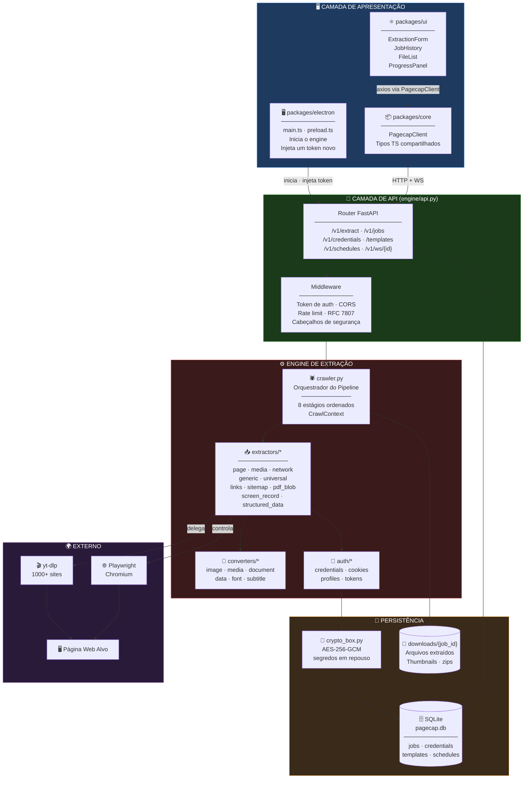
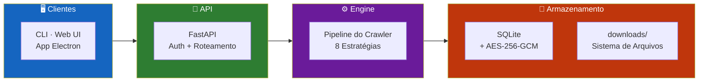
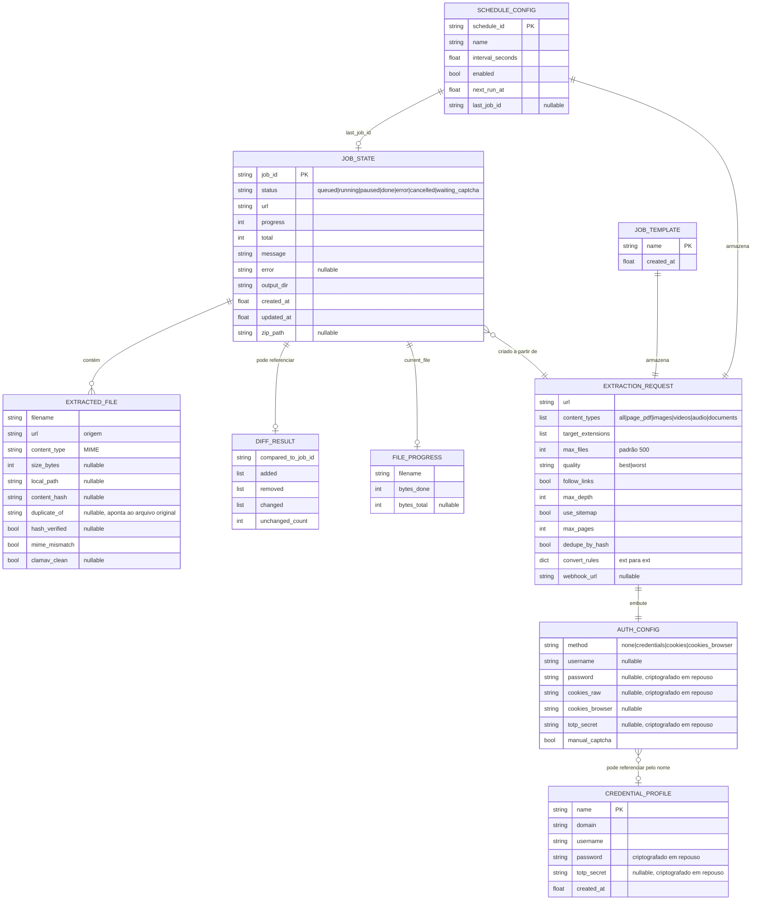
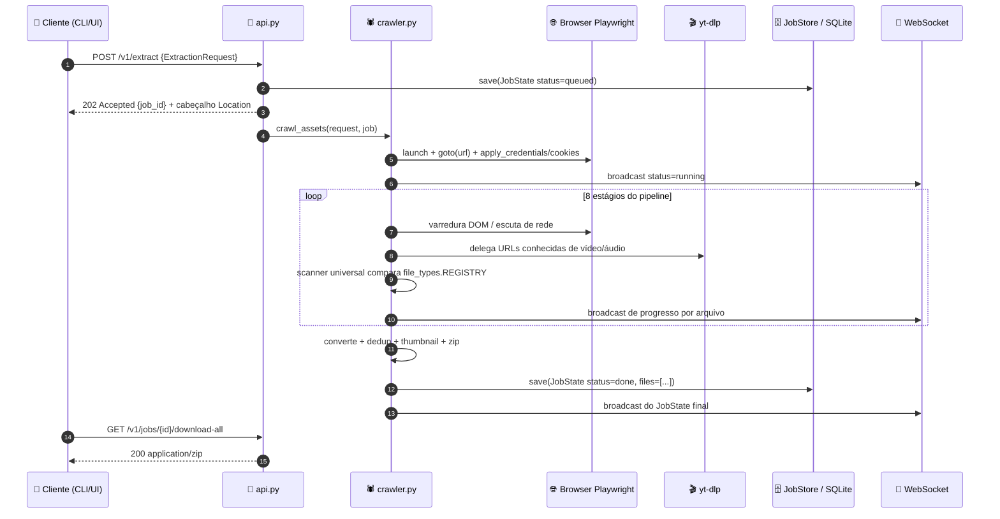
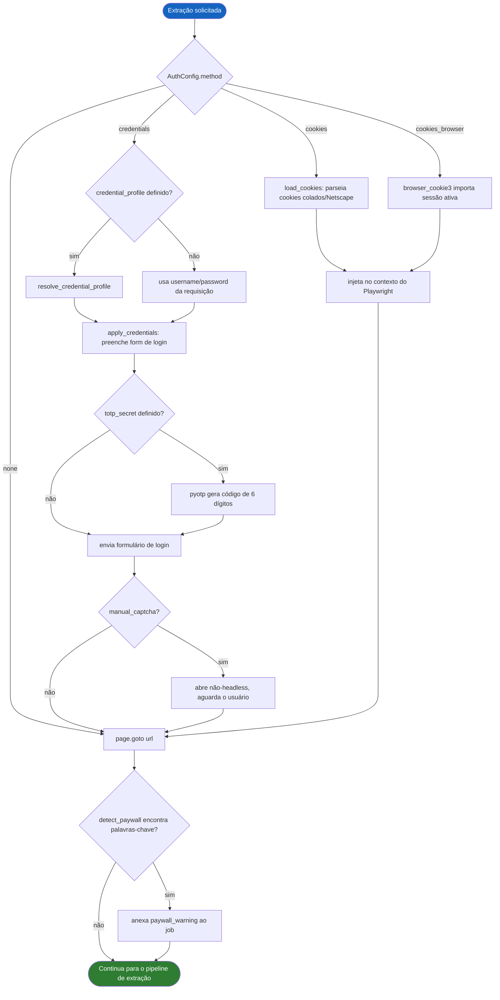
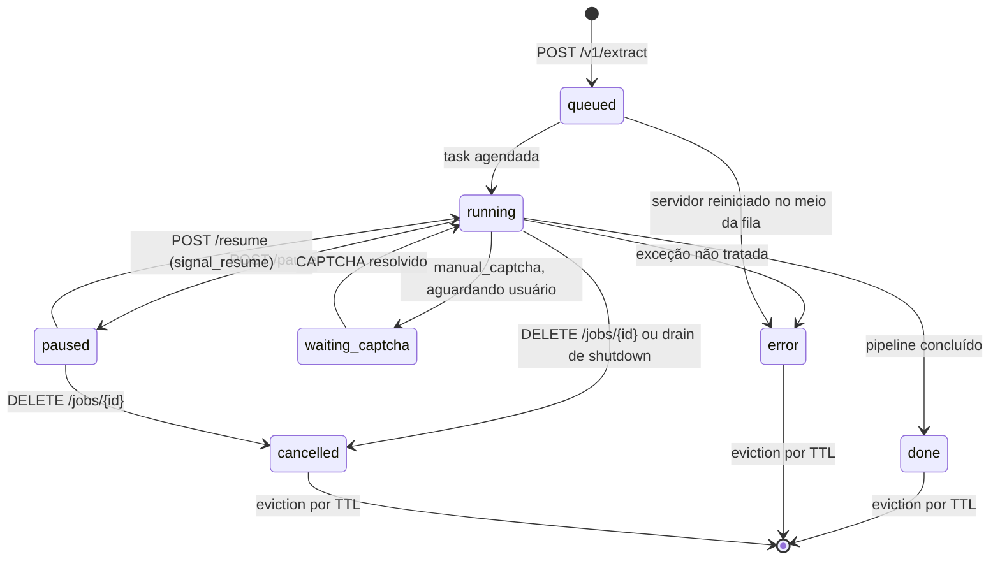
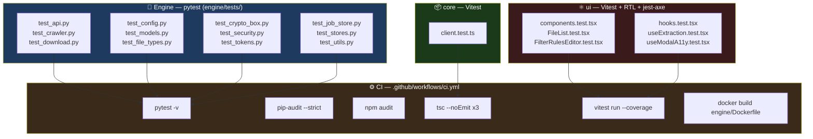

<div align="center">

**🌐 Choose Language / Selecione o Idioma / Elija el Idioma**

[](README.md)&nbsp;&nbsp;&nbsp;[](README_PT.md)&nbsp;&nbsp;&nbsp;[](README_ES.md)

</div>

---

<div align="center">

```
██████╗  █████╗  ██████╗ ███████╗ ██████╗ █████╗ ██████╗
██╔══██╗██╔══██╗██╔════╝ ██╔════╝██╔════╝██╔══██╗██╔══██╗
██████╔╝███████║██║  ███╗█████╗  ██║     ███████║██████╔╝
██╔═══╝ ██╔══██║██║   ██║██╔══╝  ██║     ██╔══██║██╔═══╝
██║     ██║  ██║╚██████╔╝███████╗╚██████╗██║  ██║██║
╚═╝     ╚═╝  ╚═╝ ╚═════╝ ╚══════╝ ╚═════╝╚═╝  ╚═╝╚═╝
      Extraia Qualquer Conteúdo de Qualquer Página Web
```

---

[](https://www.python.org/)
[](https://fastapi.tiangolo.com/)
[](https://playwright.dev/)
[](https://www.typescriptlang.org/)
[](https://react.dev/)
[](https://www.electronjs.org/)
[](LICENSE)

<br/>

> **O PageCap percorre uma página web com um browser real e extrai tudo o que existe nela**
> imagens, vídeo, áudio, documentos, ou a página inteira como PDF, via CLI, API REST/WebSocket ou app desktop.

<br/>


</div>

---

## 📑 Índice

<details>
<summary>▶️ <strong>Clique para expandir / recolher esta seção</strong></summary>

<table>
<tr>
<td valign="top" width="50%">

**🏗️ Sistema**
- [Visão Geral](#-visão-geral)
- [Arquitetura do Sistema](#️-arquitetura-do-sistema)
- [Stack Tecnológica](#️-stack-tecnológica)
- [Padrões de Projeto](#-padrões-de-projeto-aplicados)
- [Estrutura do Projeto](#-estrutura-do-projeto)

**📦 Módulos**
- [api.py — Servidor HTTP/WebSocket](#-apipy--servidor-httpwebsocket)
- [cli.py — Interface de Linha de Comando](#-clipy--interface-de-linha-de-comando)
- [extractors/crawler.py — Orquestrador do Pipeline](#️-extractorscrawlerpy--orquestrador-do-pipeline)
- [converters/ — Conversão Pós-Download](#-converters--conversão-pós-download)
- [auth/, job_store.py, stores.py, crypto_box.py, security.py, paywall.py](#-auth-job_storepy-storespy-crypto_boxpy-securitypy-paywallpy)
- [packages/core, packages/ui, packages/electron](#-packagescore-️-packagesui-️-packageselectron)

</td>
<td valign="top" width="50%">

**💼 Negócio**
- [Regras de Negócio](#-regras-de-negócio)
- [Requisitos Funcionais](#-requisitos-funcionais)
- [Requisitos Não Funcionais](#-requisitos-não-funcionais)

**📐 Design**
- [Modelo de Dados](#️-modelo-de-dados)
- [Fluxos do Sistema](#-fluxos-do-sistema)
- [Fluxo de Extração](#fluxo-de-extração-de-job)
- [Fluxo de Autenticação](#fluxo-de-autenticação)
- [Máquina de Estados do Job](#máquina-de-estados-do-ciclo-de-vida-do-job)

**🔐 Segurança & Ops**
- [Segurança](#-segurança)
- [Instalação & Execução](#-instalação--execução)
- [Testes Automatizados](#-testes-automatizados)
- [Métricas & Monitoramento](#-métricas--monitoramento)
- [Limitações Conhecidas](#️-limitações-conhecidas)

</td>
</tr>
</table>

---

</details>

## 🌟 Visão Geral

<details>
<summary>▶️ <strong>Clique para expandir / recolher esta seção</strong></summary>

**PageCap** é um kit de extração de conteúdo construído em torno de um engine Python que controla um browser Playwright real contra qualquer URL e extrai tudo o que estiver na página: imagens, vídeos, áudio, PDFs, documentos de escritório, fontes, legendas, arquivos compactados e mais, através de um registro com 150+ tipos de arquivo reconhecidos (`engine/file_types.py`). Ele é exposto de três formas: um CLI baseado em Typer (`engine/cli.py`) para scripts e jobs pontuais, um servidor FastAPI REST + WebSocket (`engine/api.py`) para clientes programáticos e de UI, e uma aplicação desktop React + Electron (`packages/ui`, `packages/electron`) que conversa com esse mesmo servidor como um processo local.

O engine de extração não é um único scraper, mas um pipeline ordenado de estratégias independentes (`engine/extractors/crawler.py`): captura de página em PDF, `yt-dlp` para os 1000+ sites que ele entende nativamente, interceptação bruta de requisições de rede para streams HLS/DASH e players customizados, varredura do DOM para tags diretas ``/`<video>`/`<audio>` e arquivos vinculados, um scanner universal que compara cada extensão registrada contra o DOM e o tráfego de rede observado, um crawling recursivo opcional no mesmo domínio (seguindo links ou guiado por sitemap), um estágio de plugins para extractors fornecidos pelo usuário e, como último recurso, gravação de tela do que renderiza na tela. Tudo que é baixado pode opcionalmente ser convertido para outro formato, deduplicado por hash de conteúdo, ter thumbnail gerado, ter o MIME verificado e ser compactado em zip; cada job é rastreado como estado durável em SQLite, então o progresso sobrevive a um reinício do servidor.

O PageCap trata a API HTTP local como uma fronteira de confiança real, não como um detalhe de implementação: a autenticação é exigida por padrão (um token é gerado no primeiro boot se nenhum estiver configurado), o CORS é restrito a `localhost`/`127.0.0.1` mais exceções explícitas, segredos (senhas de sites, seeds de TOTP, cookies brutos) são criptografados em repouso com AES-256-GCM, e toda resposta segue o padrão de problem-details da RFC 7807 com um `X-Request-ID` que se conecta aos logs JSON estruturados. Dois ADRs (`docs/adr/`) documentam o porquê: o ADR-001 explica que `127.0.0.1` é alcançável por qualquer página web que o usuário visite e, portanto, não é uma fronteira de confiança por si só; e o ADR-002 explica por que toda rota é montada sob `/v1`, mantendo os caminhos legados sem versão vivos, mas marcados como `Deprecation`/`Sunset`.

### 🎯 Objetivos do Sistema

| Objetivo | Descrição |
|-----------|-------------|
| 🌐 **Extração universal** | Reconhecer e baixar 150+ tipos de arquivo entre imagens, vídeo, áudio, documentos, fontes, legendas, dados, arquivos compactados, código, 3D e formatos de ML |
| 🎬 **Vídeo/áudio em escala** | Delegar ao `yt-dlp` para 1000+ plataformas conhecidas, com fallback para interceptação bruta de rede em HLS/DASH e players customizados |
| 📄 **Captura da página inteira** | Renderizar a página em um browser real e exportá-la como um único PDF via pipeline de impressão do Playwright |
| 🔐 **Autenticação de primeira classe** | Suportar usuário/senha, cookies colados, importação de cookies do browser, 2FA TOTP e resolução manual de CAPTCHA para conteúdo protegido |
| 🕸️ **Crawling recursivo** | Seguir opcionalmente links do mesmo domínio ou um sitemap para extrair de várias páginas em um único job |
| 🔄 **Conversão & dedup** | Converter arquivos baixados para outro formato, descartar duplicatas idênticas por hash de conteúdo e gerar thumbnails |
| 📡 **Progresso ao vivo** | Transmitir status do job, progresso em bytes por arquivo e diffs contra uma execução anterior via WebSocket |
| 🖥️ **Três superfícies, um engine** | CLI, API REST/WebSocket e app desktop Electron controlam exatamente o mesmo pipeline de extração |
| 🔒 **Seguro por padrão** | Tokens de API, segredos criptografados, erros RFC 7807, rate limiting, verificação de MIME e scan opcional com ClamAV |

---

</details>

## 🏗️ Arquitetura do Sistema

<details>
<summary>▶️ <strong>Clique para expandir / recolher esta seção</strong></summary>

### Diagrama de Módulos



### Camadas de Arquitetura



---

</details>

## 🛠️ Stack Tecnológica

<details>
<summary>▶️ <strong>Clique para expandir / recolher esta seção</strong></summary>

<table>
<thead>
<tr>
<th>Camada</th>
<th>Tecnologia</th>
<th>Versão</th>
<th>Finalidade</th>
</tr>
</thead>
<tbody>
<tr>
<td rowspan="4"><strong>🐍 Núcleo do Engine</strong></td>
<td>Python</td>
<td>3.10+</td>
<td>Linguagem do engine de extração</td>
</tr>
<tr>
<td>FastAPI</td>
<td>0.115+</td>
<td>Servidor REST + WebSocket (<code>engine/api.py</code>)</td>
</tr>
<tr>
<td>Uvicorn</td>
<td>0.30+</td>
<td>Servidor ASGI (<code>uvicorn[standard]</code>)</td>
</tr>
<tr>
<td>Pydantic</td>
<td>2.9+</td>
<td>Modelos de requisição/resposta (<code>engine/models.py</code>)</td>
</tr>
<tr>
<td rowspan="3"><strong>🌐 Browser & Mídia</strong></td>
<td>Playwright</td>
<td>1.47+</td>
<td>Automação Chromium headless/headful, página→PDF</td>
</tr>
<tr>
<td>yt-dlp</td>
<td>2024.9+</td>
<td>Download de vídeo/áudio em 1000+ sites</td>
</tr>
<tr>
<td>httpx</td>
<td>0.27+</td>
<td>Downloads HTTP assíncronos, busca de sitemap</td>
</tr>
<tr>
<td rowspan="2"><strong>💻 CLI</strong></td>
<td>Typer</td>
<td>0.12+</td>
<td><code>engine/cli.py</code> — comandos <code>extract</code>, <code>server</code>, <code>token</code></td>
</tr>
<tr>
<td>Rich</td>
<td>13.8+</td>
<td>Barras de progresso, tabelas, console colorido</td>
</tr>
<tr>
<td rowspan="2"><strong>🔐 Auth</strong></td>
<td>browser-cookie3</td>
<td>0.19+</td>
<td>Importa cookies ativos do Chrome/Firefox/Edge/Brave/Opera/Safari</td>
</tr>
<tr>
<td>pyotp / cryptography</td>
<td>2.9+ / 43.0+</td>
<td>Códigos TOTP 2FA · criptografia AES-256-GCM de segredos</td>
</tr>
<tr>
<td rowspan="5"><strong>🔁 Conversão</strong></td>
<td>Pillow + pillow-heif + pillow-avif-plugin</td>
<td>10.4+ / 0.18+ / 1.4+</td>
<td>Conversão de imagem incl. HEIC/HEIF e AVIF</td>
</tr>
<tr>
<td>cairosvg / rawpy</td>
<td>2.7+ / 0.23+</td>
<td>SVG → PNG/PDF · RAW de câmera (CR2, NEF, ARW…)</td>
</tr>
<tr>
<td>pandas / openpyxl / odfpy / pyarrow / fastavro</td>
<td>2.2+ / 3.1+ / 1.4+ / 17.0+ / 1.9+</td>
<td>Conversão tabular: CSV, XLSX, ODS, Parquet, Avro</td>
</tr>
<tr>
<td>fonttools / brotli</td>
<td>4.53+ / 1.1+</td>
<td>Conversão de formato de fonte + compressão WOFF2</td>
</tr>
<tr>
<td>pysubs2 / pdfminer.six</td>
<td>1.7+ / 20221105+</td>
<td>Conversão de legendas · extração de texto PDF de fallback</td>
</tr>
<tr>
<td rowspan="4"><strong>⚛️ Web UI</strong></td>
<td>React</td>
<td>18.3</td>
<td><code>packages/ui</code> — árvore de componentes</td>
</tr>
<tr>
<td>Vite</td>
<td>8.1</td>
<td>Servidor de dev + build</td>
</tr>
<tr>
<td>TypeScript</td>
<td>5.6</td>
<td>Compartilhado nos três workspaces npm</td>
</tr>
<tr>
<td>lucide-react</td>
<td>0.441+</td>
<td>Conjunto de ícones</td>
</tr>
<tr>
<td rowspan="2"><strong>🖥️ Desktop</strong></td>
<td>Electron</td>
<td>43</td>
<td><code>packages/electron</code> — inicia o engine, injeta um token</td>
</tr>
<tr>
<td>electron-builder</td>
<td>26.15+</td>
<td>Empacotamento NSIS (Windows) / DMG (macOS) / AppImage (Linux)</td>
</tr>
<tr>
<td rowspan="2"><strong>📦 Cliente Compartilhado</strong></td>
<td>axios</td>
<td>1.7+</td>
<td><code>packages/core</code> — wrapper HTTP <code>PagecapClient</code></td>
</tr>
<tr>
<td>vitest</td>
<td>4.1+</td>
<td>Testes unitários de <code>core</code> e <code>ui</code></td>
</tr>
<tr>
<td rowspan="3"><strong>🧪 Testes & QA</strong></td>
<td>pytest</td>
<td>—</td>
<td>Suíte de testes do engine (<code>engine/tests/</code>, <code>pytest.ini</code>)</td>
</tr>
<tr>
<td>@testing-library/react + jest-axe</td>
<td>16.3+ / 9.0+</td>
<td>Testes de componentes UI + verificações de acessibilidade</td>
</tr>
<tr>
<td>pip-audit / npm audit</td>
<td>—</td>
<td>Varredura de vulnerabilidades de dependências no CI</td>
</tr>
</tbody>
</table>

---

</details>

## 🎨 Padrões de Projeto Aplicados

<details>
<summary>▶️ <strong>Clique para expandir / recolher esta seção</strong></summary>

| Padrão | Onde | Justificativa |
|---------|-------|-----------|
| 🚏 **Pipeline / Chain of Responsibility** | `extractors/crawler.py` — lista de `_Stage` executada em sequência sobre um `CrawlContext` compartilhado | Adicionar ou reordenar uma estratégia de extração vira editar uma lista, não uma função de 400 linhas; cada estágio ganha cancelamento/pausa uniformes de graça |
| 🧺 **Context Object** | dataclass `CrawlContext` | Agrupa ~15 pedaços de estado compartilhado, transformando estágios em funções testáveis independentemente em vez de closures |
| 🏭 **Registry** | `file_types.REGISTRY`, `_CT_TO_CATEGORIES` em `crawler.py` | 150+ tipos de arquivo e seus alvos de conversão são declarados como dados, consultados por extensão, não ramificados em código |
| 🔌 **Plugin / Extension Point** | `plugins.py` — `load_plugins()` importa qualquer `extract()` em `PAGECAP_PLUGINS_DIR` | Estágios de extração de terceiros são adicionados sem tocar no código central, isolados para que um plugin quebrado não derrube um job |
| 🎯 **Facade** | `auth/credentials.py::apply_credentials`, `auth/cookies.py::load_cookies` | Uma chamada cada esconde preenchimento de formulário via Playwright, geração de TOTP e parsing de cookie jar de browser atrás de uma assinatura simples |
| 🛡️ **Fail-Closed Guard** | `api.py::_is_authorized`, `_websocket_allowed` | Toda rota exceto `/health*` é negada a menos que a autorização seja comprovada; não há ramo de permissão implícita |
| 🧊 **Configuração Imutável** | `config.py::Settings` — `dataclass` congelada, lida uma vez no import | Evita o bug histórico em que `api.py` e `auth/profiles.py` liam `os.getenv` independentemente e podiam divergir |
| 🔁 **Strategy** | `converters/*.py` — um módulo por categoria de mídia (image, document, data, font, subtitle, media) | A lógica de conversão varia completamente por família de formato; cada converter é trocado pelos alvos declarados em `can_convert_to` |
| 🌊 **Async Generator / Streaming** | Funções extractor fazem `yield ExtractedFile` conforme encontram | Arquivos aparecem na UI assim que são encontrados, não depois que a página inteira termina de ser percorrida |
| 🚦 **Draining estilo Circuit-Breaker** | `api.py::_drain_jobs` no shutdown | Jobs em andamento ganham uma janela de graça limitada para terminar de forma limpa em vez de serem mortos no meio de uma escrita |

---

</details>

## 📁 Estrutura do Projeto

<details>
<summary>▶️ <strong>Clique para expandir / recolher esta seção</strong></summary>

```
PageCap/
│
├── 📄 package.json                    # Raiz do workspace npm: scripts dev/build/test dos 3 pacotes
├── 📄 package-lock.json
├── 📄 setup.bat / setup.sh            # Bootstrap único do ambiente (Windows / Unix)
├── 📄 .env.example                    # Toda variável de ambiente PAGECAP_*, documentada
├── 📄 LICENSE                         # MIT
│
├── 📂 engine/                         # 🐍 Engine de extração em Python
│   ├── 📄 api.py                      # Servidor FastAPI REST + WebSocket, ciclo de vida de jobs, middleware
│   ├── 📄 cli.py                      # CLI Typer: comandos extract / server / token
│   ├── 📄 config.py                   # Dataclass Settings congelada — fonte única de config de ambiente
│   ├── 📄 models.py                   # Modelos Pydantic: ExtractionRequest, JobState, etc.
│   ├── 📄 converter.py                # Despacha para o módulo converters/* correto pela extensão
│   ├── 📄 crypto_box.py               # Criptografia AES-256-GCM para segredos armazenados
│   ├── 📄 download.py                 # Download assíncrono em chunks com retry, hash, progresso
│   ├── 📄 file_types.py               # Registro de 150+ extensões e tipos MIME reconhecidos
│   ├── 📄 job_store.py                # Persistência SQLite de JobState (sobrevive a reinícios)
│   ├── 📄 logging_config.py           # Logging JSON estruturado + contexto de request-id
│   ├── 📄 paywall.py                  # Detecção heurística de texto de paywall/login-wall
│   ├── 📄 plugins.py                  # Carrega plugins de extractor fornecidos pelo usuário
│   ├── 📄 problem_details.py          # Respostas de erro RFC 7807
│   ├── 📄 security.py                 # Sniffing de MIME por magic-byte + scan ClamAV opcional
│   ├── 📄 stores.py                   # Persistência SQLite de credenciais/templates/schedules
│   ├── 📄 thumbnails.py               # Geração de thumbnails para mídia extraída
│   ├── 📄 utils.py                    # Helpers compartilhados
│   ├── 📄 requirements.txt            # Dependências Python de runtime
│   ├── 📄 requirements-dev.txt        # + pytest e ferramentas de dev
│   ├── 📄 pytest.ini                  # Configuração de testes
│   ├── 📄 Dockerfile                  # Imagem de container do engine
│   │
│   ├── 📂 extractors/                 # Estágios do pipeline, uma estratégia por módulo
│   │   ├── crawler.py                 # Orquestrador: CrawlContext + lista ordenada de _Stage
│   │   ├── page.py                    # Captura de Página → PDF (print do Playwright)
│   │   ├── media.py                   # Vídeo/áudio via yt-dlp
│   │   ├── network.py                 # Interceptação bruta de rede (HLS/DASH, players customizados)
│   │   ├── generic.py                 # Varredura do DOM para /<video>/<audio> e arquivos vinculados
│   │   ├── universal.py               # Compara todos os 150+ tipos registrados contra DOM + rede
│   │   ├── links.py                   # Descoberta de links do mesmo domínio para crawling recursivo
│   │   ├── sitemap.py                 # Descoberta de URLs guiada por sitemap.xml
│   │   ├── pdf_blob.py                # Extrai PDFs servidos como blobs dentro da página
│   │   ├── screen_record.py           # Fallback de gravação de tela, último recurso
│   │   └── structured_data.py         # Extração de JSON-LD / microdata, exportação CSV
│   │
│   ├── 📂 converters/                 # Conversão de formato pós-download, um módulo por família
│   │   ├── image.py                   # Conversões JPG/PNG/WebP/AVIF/HEIC/SVG/RAW
│   │   ├── document.py                # Conversões de Texto/Word/ODT/PDF/EPUB
│   │   ├── data.py                    # Conversões CSV/XLSX/ODS/Parquet/Avro
│   │   ├── media.py                   # Recodificação de áudio/vídeo
│   │   ├── font.py                    # Conversões de formato de fonte + WOFF2
│   │   └── subtitle.py                # Conversões de formato de legenda
│   │
│   ├── 📂 auth/                       # Autenticação no site alvo extraído (não a da API)
│   │   ├── credentials.py             # Preenchimento automático de login via Playwright
│   │   ├── cookies.py                 # Parseia cookies colados / arquivos Netscape
│   │   ├── profiles.py                # Resolve um CredentialProfile salvo pelo nome
│   │   └── tokens.py                  # Gera/persiste o token bearer da API do PageCap
│   │
│   └── 📂 tests/                      # Suíte pytest — ver seção Testes Automatizados
│       ├── test_api.py · test_config.py · test_crawler.py · test_crypto_box.py
│       ├── test_download.py · test_file_types.py · test_job_store.py · test_models.py
│       └── test_security.py · test_stores.py · test_tokens.py · test_utils.py
│
├── 📂 packages/                       # Workspaces npm em TypeScript
│   ├── 📂 core/                       # @pagecap/core — tipos compartilhados + cliente HTTP/WS
│   │   └── src/
│   │       ├── client.ts              # PagecapClient (baseado em axios)
│   │       ├── client.test.ts
│   │       ├── types.ts               # ExtractionRequest, JobState, etc. espelhando models.py
│   │       └── index.ts
│   │
│   ├── 📂 ui/                         # @pagecap/ui — interface web React + Vite
│   │   └── src/
│   │       ├── App.tsx                # Componente raiz, integração tema/idioma
│   │       ├── apiClient.ts           # Envolve @pagecap/core para o build de browser
│   │       ├── i18n.ts                # Traduções da UI
│   │       ├── format.ts / notify.ts  # Helpers de formatação, notificações toast
│   │       ├── components/            # ExtractionForm, FileList, JobHistory,
│   │       │                          # FilterRulesEditor, ProgressPanel, Theme/LanguageToggle
│   │       ├── hooks/                 # useExtraction, useTheme, useModalA11y, useKeyboardShortcuts
│   │       └── test/                  # Setup RTL, harness de acessibilidade jest-axe
│   │
│   └── 📂 electron/                   # @pagecap/electron — wrapper desktop
│       └── src/
│           ├── main.ts                # Inicia o engine Python, gera um token por execução
│           └── preload.ts             # Ponte IPC segura para o renderer
│
├── 📂 docs/adr/                       # Registros de Decisão de Arquitetura
│   ├── ADR-001-local-api-trust-boundary.md   # Por que loopback ≠ fronteira de confiança, auth por token
│   └── ADR-002-api-versioning.md             # Por que toda rota vive sob /v1
│
├── 📂 .github/workflows/              # CI: pytest, pip-audit, npm audit, typecheck,
│   └── ci.yml                         # Vitest + gate de cobertura, 3 builds, build da imagem Docker
│
├── 📄 README.md                       # 🇺🇸 English (primário)
├── 📄 README_PT.md                    # 🇧🇷 Português
└── 📄 README_ES.md                    # 🇪🇸 Español
```

---

</details>

## 📦 Módulos do Sistema

<details>
<summary>▶️ <strong>Clique para expandir / recolher esta seção</strong></summary>

### 🚏 `api.py` — Servidor HTTP/WebSocket

Aplicação FastAPI que expõe o engine via REST e WebSocket. Monta toda rota duas vezes, uma sob `/v1` (canônica) e outra na raiz (`include_in_schema=False`, marcada `Deprecation`/`Sunset` conforme o ADR-002).

| Responsabilidade | Implementação |
|-----------------|-----------------|
| Ciclo de vida do job | `POST /v1/extract`, `GET /v1/jobs/{id}`, `DELETE /v1/jobs/{id}`, `/pause`, `/resume` |
| Acesso a arquivos | `/v1/jobs/{id}/files`, `/download/{filename}`, `/preview/{filename}` (checagem de MIME seguro inline), `/download-all` (zip) |
| Progresso ao vivo | `/v1/ws/{job_id}` — envia o `JobState` completo em JSON ao conectar e após cada mudança de estado |
| Presets | `/v1/credentials`, `/v1/templates`, `/v1/schedules` — pacotes `ExtractionRequest` salvos |
| Health & métricas | `/health`, `/health/live`, `/health/ready` (sem auth), `/v1/metrics` (métricas RED com percentis) |
| Middleware de auth | Token bearer ou parâmetro de query `?token=`, comparação em tempo constante via `hmac.compare_digest` |
| Rate limiting | Janela deslizante de 60s por IP, `PAGECAP_RATE_LIMIT_PER_MINUTE` (0 = desligado) |
| Loops em segundo plano | `_eviction_loop` (limpeza por TTL), `_scheduler_loop` (dispara linhas `ScheduleConfig` vencidas) |
| Shutdown gracioso | `_drain_jobs` cancela jobs em execução cooperativamente dentro de `PAGECAP_SHUTDOWN_DRAIN_SECONDS` |

---

### 💻 `cli.py` — Interface de Linha de Comando

Aplicação Typer com três comandos, construída sobre o mesmo pipeline `crawl_assets` usado pelo servidor.

| Comando | Finalidade | Opções-chave |
|---------|---------|-------------|
| `extract` | Executa um job de extração até o fim, imprimindo barra de progresso Rich e tabela de resultados | `--type`, `--username/--password`, `--cookies`, `--browser`, `--convert`, `--follow-links`, `--json` |
| `server` | Inicia o servidor FastAPI (`uvicorn api:app`) | `--host`, `--port`, `--reload` |
| `token` | Exibe (ou gera) o token bearer da API que o servidor em execução exige | `--show` |

---

### 🕷️ `extractors/crawler.py` — Orquestrador do Pipeline

O coração do engine. `crawl_assets(request, job, on_progress)` executa 8 estágios ordenados sobre uma dataclass `CrawlContext` compartilhada, cada estágio um nome mais um callable assíncrono, de modo que o pipeline é dado, não uma função de controle de fluxo monolítica. Depois de todos os estágios: conversão, geração de thumbnails, diff contra o job anterior para a mesma URL, empacotamento em zip e notificação por webhook.

| # | Estágio | Arquivo | Roda quando |
|---|-------|------|-----------|
| 1 | Página → PDF | `page.py` | `content_types` inclui `page_pdf` |
| 2 | Download via yt-dlp | `media.py` | `want_media` e a URL/página corresponde a uma plataforma conhecida |
| 3 | Interceptação de rede | `network.py` | `want_media`, para HLS/DASH e players customizados que o yt-dlp não resolve |
| 4 | Varredura do DOM | `generic.py` | Sempre, para tags diretas ``/`<video>`/`<audio>` e arquivos vinculados |
| 5 | Scanner universal | `universal.py` | Sempre, compara cada extensão de `file_types.REGISTRY` contra DOM + rede |
| 6 | Crawling recursivo | `links.py`, `sitemap.py` | `follow_links` ou `use_sitemap` está ativo |
| 7 | Plugins | `plugins.py` | Qualquer `*.py` em `PAGECAP_PLUGINS_DIR` que exponha `extract()` |
| 8 | Gravação de tela | `screen_record.py` | `screen_record` está ativo, como fallback para conteúdo protegido |

`pdf_blob.py` extrai PDFs que a página constrói como blobs em memória em vez de servir como URL (integrado ao estágio 5); `structured_data.py` extrai JSON-LD/microdata e pode exportá-los para CSV (`export_structured_data_csv`).

---

### 🔁 `converters/` — Conversão Pós-Download

Invocado por `converter.py`, que roteia um arquivo baixado ao módulo correto pela extensão de destino, checada contra `FileTypeInfo.can_convert_to` em `file_types.py`.

| Módulo | Trata |
|--------|---------|
| `image.py` | Conversões JPG/PNG/GIF/WebP/AVIF/HEIC/TIFF/SVG/RAW via Pillow, pillow-heif, pillow-avif-plugin, cairosvg, rawpy |
| `document.py` | Conversões TXT/MD/RTF/DOC/DOCX/ODT/PDF/EPUB (pipelines de texto estilo pandoc, fallback pdfminer.six) |
| `data.py` | CSV/TSV/XLSX/ODS/JSON/Parquet/Avro via pandas, openpyxl, odfpy, pyarrow, fastavro |
| `media.py` | Recodificação de áudio/vídeo |
| `font.py` | Conversão de formato de fonte e compressão WOFF2 via fonttools + brotli |
| `subtitle.py` | Conversão de formato de legenda via pysubs2 |

---

### 🔑 `auth/`, `job_store.py`, `stores.py`, `crypto_box.py`, `security.py`, `paywall.py`

`auth/` trata dois tipos distintos de autenticação: o login no **site alvo** sendo extraído, e o token bearer da **própria API do PageCap**.

| Arquivo | Papel |
|------|------|
| `auth/credentials.py` | `apply_credentials()` — preenchimento automático de formulário de login via Playwright, incluindo geração de código TOTP a partir de um segredo salvo |
| `auth/cookies.py` | `load_cookies()` — parseia strings de cookie coladas, arquivos de cookie Netscape, ou importa cookies ativos via `browser-cookie3` |
| `auth/profiles.py` | `resolve_credential_profile()` — busca um `CredentialProfile` salvo pelo nome |
| `auth/tokens.py` | `resolve_api_token()` — gera e persiste o token bearer da própria API em `.pagecap_token` |
| `job_store.py` | Linhas de `JobState` em SQLite (tabela `jobs`); jobs `ATIVOS` no boot são marcados `error`, pois sua task em processo se perdeu |
| `stores.py` | `CredentialProfile`, `JobTemplate`, `ScheduleConfig` — presets reutilizáveis, cada um como blob JSON indexado pelo nome |
| `crypto_box.py` | `SecretBox` criptografa senhas/segredos TOTP/cookies brutos com AES-256-GCM antes de `stores.py` gravá-los; a chave vem de `PAGECAP_SECRET_KEY` ou de um `.pagecap_key` gerado (0600); linhas antigas em texto puro ainda decifram e recriptografam de forma transparente |
| `security.py` | `sniff_category()`/`verify_mime()` sinalizam divergência de magic-byte contra a extensão declarada; `clamav_scan()` roda um binário ClamAV instalado localmente, se presente |
| `paywall.py` | `detect_paywall()` varre o texto visível da página em busca de frases de paywall/login-wall e anexa um aviso em vez de bloquear a extração |

---

### 📦 `packages/core`, ⚛️ `packages/ui`, 🖥️ `packages/electron`

`@pagecap/core` é o contrato compartilhado entre a web UI e o Electron: `types.ts` espelha cada modelo Pydantic em `engine/models.py`, e `client.ts` exporta `PagecapClient`, um wrapper baseado em axios para cada endpoint REST mais helpers de WebSocket.

`@pagecap/ui` é uma SPA Vite + React 18. `ExtractionForm` monta um `ExtractionRequest`, `ProgressPanel` renderiza atualizações de WebSocket ao vivo, `FileList` mostra e pré-visualiza arquivos extraídos, `JobHistory` lista jobs anteriores, e `FilterRulesEditor` configura filtragem de extensão/domínio. `useTheme` e `LanguageToggle` fornecem alternância de tema claro/escuro e i18n; `useModalA11y` e a suíte jest-axe mantêm os diálogos acessíveis.

O `main.ts` do `@pagecap/electron` inicia o engine Python como processo filho ao abrir o app, gera um token de API aleatório novo a cada execução, e o injeta no renderer via uma ponte IPC `preload.ts`. Empacotado via `electron-builder` (NSIS/DMG/AppImage), empacotando `packages/ui/dist` e `engine/` como recurso extra.

---

</details>

## 💼 Regras de Negócio

<details>
<summary>▶️ <strong>Clique para expandir / recolher esta seção</strong></summary>

### 🕷️ Regras de Extração

| # | Regra | Aplicação |
|---|------|-------------|
| RN-01 | Toda extração tem como alvo uma URL primária, opcionalmente com `additional_urls` agrupadas no mesmo job | `ExtractionRequest.url` + `.additional_urls` |
| RN-02 | Um job nunca retorna mais que `max_files` arquivos extraídos (padrão 500) | Aplicado durante o loop de crawling em `crawler.py` |
| RN-03 | O crawling recursivo só segue links no mesmo domínio da URL semente | `extractors/links.py::discover_same_domain_links` |
| RN-04 | O crawling recursivo é limitado tanto por `max_depth` quanto por `max_pages` | Verificado antes de cada busca de página adicional |
| RN-05 | Arquivos abaixo de `min_file_size_bytes` ou acima de `max_file_size_bytes` são ignorados | Aplicado no estágio de download |
| RN-06 | Um job aborta assim que o total de bytes baixados excederia `max_job_size_bytes` (se definido) | Verificado antes de cada download de arquivo |
| RN-07 | Domínios em `blocked_domains` nunca são buscados, mesmo que descobertos pelo crawling | Verificado na camada de rede/download |
| RN-08 | Quando `dedupe_by_hash` é verdadeiro, arquivos idênticos byte a byte são registrados uma vez, com `duplicate_of` apontando para o original | Comparação de hash de conteúdo durante o download |

### 🔐 Regras de Autenticação

| # | Regra | Aplicação |
|---|------|-------------|
| RN-09 | Exatamente um método de auth se aplica por job: nenhum, credenciais, cookies colados, ou cookies importados do browser | `AuthConfig.method` |
| RN-10 | `manual_captcha=true` força o browser a abrir de forma visível (não headless), independente da configuração `headless` | Lógica de abertura de browser em `crawler.py` |
| RN-11 | Uma referência `credential_profile` resolve para um perfil salvo; a requisição nunca precisa carregar a senha inline | `auth/profiles.py::resolve_credential_profile` |
| RN-12 | Senhas armazenadas, segredos TOTP e cookies brutos são sempre criptografados antes de serem gravados no SQLite | `crypto_box.SecretBox` usado dentro de `stores.py` |

### 🔑 Regras de Acesso à API

| # | Regra | Aplicação |
|---|------|-------------|
| RN-13 | Toda rota exceto `/health`, `/health/live`, `/health/ready` exige um token bearer válido, a menos que a auth esteja explicitamente desligada | `api.py::_is_authorized`, `_UNAUTHENTICATED_PATHS` |
| RN-14 | `GET /templates` e `GET /schedules` nunca retornam `password`/`totp_secret`/`cookies_raw` | `models.PUBLIC_EXCLUDE` aplicado via `model_dump(exclude=...)` |
| RN-15 | `GET /credentials` nunca retorna a senha armazenada ou o segredo TOTP, jamais | `exclude={"password","totp_secret"}` explícito |
| RN-16 | A linha no banco de um job cancelado é mantida (não apagada), para que seu histórico continue inspecionável; apenas a eviction por TTL a remove | `DELETE /v1/jobs/{id}` altera o status, não apaga a linha |

---

</details>

## ✅ Requisitos Funcionais

<details>
<summary>▶️ <strong>Clique para expandir / recolher esta seção</strong></summary>

| ID | Requisito | Prioridade | Status |
|----|-------------|----------|--------|
| **RF-01** | O sistema deve extrair imagens, vídeos, áudio e documentos de uma URL informada | 🔴 Alta | ✅ Implementado |
| **RF-02** | O sistema deve renderizar a página alvo e exportá-la como um único PDF | 🔴 Alta | ✅ Implementado |
| **RF-03** | O sistema deve baixar vídeo/áudio via yt-dlp para plataformas que reconhece | 🔴 Alta | ✅ Implementado |
| **RF-04** | O sistema deve interceptar requisições brutas de rede para capturar streams que o yt-dlp não resolve | 🟡 Média | ✅ Implementado |
| **RF-05** | O sistema deve reconhecer 150+ extensões de arquivo e seus tipos MIME | 🔴 Alta | ✅ Implementado |
| **RF-06** | O sistema deve suportar login via usuário/senha no site alvo | 🔴 Alta | ✅ Implementado |
| **RF-07** | O sistema deve suportar cookies colados e cookies importados de um browser instalado | 🔴 Alta | ✅ Implementado |
| **RF-08** | O sistema deve suportar 2FA baseado em TOTP durante o login automatizado | 🟡 Média | ✅ Implementado |
| **RF-09** | O sistema deve suportar resolução manual de CAPTCHA abrindo um browser visível | 🟡 Média | ✅ Implementado |
| **RF-10** | O sistema deve, opcionalmente, seguir links do mesmo domínio recursivamente, limitado por profundidade e número de páginas | 🟡 Média | ✅ Implementado |
| **RF-11** | O sistema deve, opcionalmente, descobrir URLs via `sitemap.xml` | 🟢 Baixa | ✅ Implementado |
| **RF-12** | O sistema deve converter arquivos baixados para um formato de destino solicitado | 🟡 Média | ✅ Implementado |
| **RF-13** | O sistema deve deduplicar arquivos baixados por hash de conteúdo | 🟡 Média | ✅ Implementado |
| **RF-14** | O sistema deve gerar thumbnails para mídia extraída sob demanda | 🟢 Baixa | ✅ Implementado |
| **RF-15** | O sistema deve reportar progresso ao vivo, incluindo contagem de bytes por arquivo, via WebSocket | 🔴 Alta | ✅ Implementado |
| **RF-16** | O sistema deve permitir pausar, retomar e cancelar um job em execução | 🟡 Média | ✅ Implementado |
| **RF-17** | O sistema deve comparar (diff) os arquivos de um job contra a execução anterior mais recente da mesma URL | 🟢 Baixa | ✅ Implementado |
| **RF-18** | O sistema deve persistir o histórico de jobs em SQLite, sobrevivendo a um reinício do servidor | 🔴 Alta | ✅ Implementado |
| **RF-19** | O sistema deve suportar perfis de credenciais salvos, templates de job e agendamentos recorrentes | 🟡 Média | ✅ Implementado |
| **RF-20** | O sistema deve detectar e avisar sobre conteúdo provavelmente protegido por paywall/login-wall | 🟢 Baixa | ✅ Implementado |
| **RF-21** | O sistema deve, opcionalmente, verificar os magic bytes de cada arquivo contra seu tipo MIME declarado | 🟡 Média | ✅ Implementado |
| **RF-22** | O sistema deve, opcionalmente, escanear arquivos baixados com um ClamAV instalado localmente | 🟢 Baixa | ✅ Implementado |
| **RF-23** | O sistema deve expor tudo acima via CLI, API REST/WebSocket e app desktop | 🔴 Alta | ✅ Implementado |

---

</details>

## ⚡ Requisitos Não Funcionais

<details>
<summary>▶️ <strong>Clique para expandir / recolher esta seção</strong></summary>

| ID | Categoria | Requisito | Alvo |
|----|----------|-------------|--------|
| **RNF-01** | ⚡ Desempenho | Downloads concorrentes de arquivo dentro de um job | `download_concurrency` (padrão 6) |
| **RNF-02** | ⚡ Desempenho | Limitação de frequência de broadcast de progresso em bytes | ≤ 4 mensagens/segundo por arquivo (`emit_file_progress`) |
| **RNF-03** | 🔁 Confiabilidade | Downloads falhados são retentados automaticamente | `download_retries` (padrão 2) |
| **RNF-04** | 🔁 Confiabilidade | Jobs em andamento sobrevivem à falha de um estágio isolado | Cada estágio embrulhado independentemente; o job segue para o próximo estágio |
| **RNF-05** | 🔁 Confiabilidade | Shutdown gracioso drena jobs em execução em vez de matá-los | `PAGECAP_SHUTDOWN_DRAIN_SECONDS` (padrão 20s) |
| **RNF-06** | 🔐 Segurança | Autenticação da API exigida por padrão | Token gerado no primeiro boot se não configurado (ADR-001) |
| **RNF-07** | 🔐 Segurança | Acesso cross-origin restrito a loopback + origens explícitas | `allow_origin_regex`, `PAGECAP_CORS_ORIGINS` |
| **RNF-08** | 🔐 Segurança | Segredos criptografados em repouso | AES-256-GCM via `crypto_box.py` |
| **RNF-09** | 🔐 Segurança | Toda resposta carrega cabeçalhos de segurança básicos | `X-Content-Type-Options`, `CSP`, `Referrer-Policy`, `X-Frame-Options` |
| **RNF-10** | 🔐 Segurança | Rate limiting disponível por IP de cliente | `PAGECAP_RATE_LIMIT_PER_MINUTE`, 0 = desligado |
| **RNF-11** | 📈 Escalabilidade | A listagem de jobs permanece O(1) por página, independente do tamanho do histórico | Paginação por cursor/keyset em `GET /v1/jobs` |
| **RNF-12** | 📈 Escalabilidade | Dados antigos de job não se acumulam indefinidamente | Varredura de eviction por TTL, padrão 3 dias |
| **RNF-13** | 👁️ Observabilidade | Toda requisição é rastreável de ponta a ponta | Cabeçalho `X-Request-ID` ↔ campo de log JSON estruturado |
| **RNF-14** | 👁️ Observabilidade | Métricas RED disponíveis para a superfície da API | `GET /v1/metrics` com latência p50/p95/p99/p99.9 |
| **RNF-15** | ♿ Acessibilidade | Diálogos da web UI são navegáveis por teclado e leitor de tela | Hook `useModalA11y` + verificações jest-axe no CI |
| **RNF-16** | 🧩 Compatibilidade | Respostas da API permanecem aditivas dentro de uma versão | Versionamento `/v1`, `Deprecation`/`Sunset` em caminhos legados (ADR-002) |

---

</details>

## 🗄️ Modelo de Dados

<details>
<summary>▶️ <strong>Clique para expandir / recolher esta seção</strong></summary>

O PageCap não tem um esquema relacional no sentido tradicional: o SQLite armazena cada `JobState`, `CredentialProfile`, `JobTemplate` e `ScheduleConfig` como um único blob JSON (`model_dump_json()` do Pydantic) por linha, indexado pela chave primária e, para jobs, por `status`/`updated_at` para a varredura de TTL. O diagrama abaixo modela essas estruturas como entidades para tornar os relacionamentos explícitos, ainda que não existam foreign keys SQL.

### Diagrama Entidade-Relacionamento



### Layout das Tabelas SQLite

| Tabela (`stores.py` / `job_store.py`) | Chave | Valor | Índices |
|---|---|---|---|
| `jobs` | `job_id` | `JobState` completo como JSON | `status`, `updated_at` (eviction por TTL) |
| `credentials` | `name` | `CredentialProfile` como JSON (senha/TOTP criptografados) | — |
| `templates` | `name` | `JobTemplate` como JSON | — |
| `schedules` | `name` | `ScheduleConfig` como JSON | — |

### Chaves de Configuração (`.env` / ambiente)

| Chave | Padrão | Finalidade |
|---|---|---|
| `PAGECAP_API_TOKEN` | gerado automaticamente | Token bearer exigido nas rotas protegidas |
| `PAGECAP_REQUIRE_AUTH` | `1` | Interruptor mestre da exigência de auth |
| `PAGECAP_SECRET_KEY` | arquivo gerado automaticamente | Chave AES-256-GCM para segredos armazenados |
| `PAGECAP_DB_PATH` | `pagecap.db` | Local do arquivo SQLite |
| `PAGECAP_DOWNLOADS_DIR` | `downloads` | Raiz do diretório de saída por job |
| `PAGECAP_JOB_TTL_SECONDS` | `259200` (3 dias) | Jobs finalizados mais antigos que isso são removidos |
| `PAGECAP_RATE_LIMIT_PER_MINUTE` | `0` (desligado) | Limite de requisições por IP |
| `PAGECAP_PLUGINS_DIR` | não definido | Diretório de plugins de extractor customizados confiáveis |
| `PAGECAP_LOG_LEVEL` | `INFO` | Verbosidade do logging estruturado |

---

</details>

## 🔄 Fluxos do Sistema

<details>
<summary>▶️ <strong>Clique para expandir / recolher esta seção</strong></summary>

### Fluxo de Extração de Job



### Fluxo de Autenticação



### Máquina de Estados do Ciclo de Vida do Job



---

</details>

## 🔐 Segurança

<details>
<summary>▶️ <strong>Clique para expandir / recolher esta seção</strong></summary>

### Controles Implementados

| Controle | Implementação | Efeito |
|---------|-----------------|--------|
| 🔑 **Token bearer obrigatório** | `resolve_api_token()`; gerado e persistido automaticamente em `.pagecap_token` (0600) se não definido | Toda rota exceto `/health*` rejeita requisições não autenticadas por padrão (ADR-001) |
| ⏱️ **Comparação em tempo constante** | `hmac.compare_digest` em `_is_authorized` e `_websocket_allowed` | Evita adivinhação de token por timing |
| 🌐 **CORS restrito** | `allow_origin_regex` limitado a `localhost`/`127.0.0.1`; origem `null` só permitida via opt-in explícito | Impede que sites arbitrários leiam a API local em configurações normais |
| 🔌 **Auth de WebSocket repetida manualmente** | `_websocket_allowed()` reverifica token/origem, já que o Starlette pula o middleware HTTP no escopo ws | Fecha exatamente a brecha identificada pelo ADR-001: `/ws` não é coberto implicitamente pelo middleware HTTP |
| 🔐 **Segredos criptografados em repouso** | `crypto_box.SecretBox` (AES-256-GCM) aplicado a senhas/segredos TOTP/cookies brutos antes de gravar no SQLite | Um arquivo `pagecap.db` roubado não entrega credenciais em texto puro |
| 🙈 **Redação de campos secretos** | `models.PUBLIC_EXCLUDE` aplicado a `/templates`, `/schedules`; exclusão explícita em `/credentials` | Presets salvos nunca vazam senhas/segredos TOTP pela API |
| 🧾 **Erros RFC 7807 + rastreabilidade** | `problem_details.py`, cabeçalho `X-Request-ID` ligado aos logs JSON estruturados | Erros são diagnosticáveis sem expor stack traces ao cliente |
| 🛡️ **Cabeçalhos de segurança básicos** | `X-Content-Type-Options`, `Content-Security-Policy: default-src 'none'; sandbox`, `Referrer-Policy`, `X-Frame-Options` em toda resposta | Defesa em profundidade contra content-sniffing e ataques de framing |
| 🚦 **Rate limiting** | Janela deslizante de 60s por IP de cliente, `PAGECAP_RATE_LIMIT_PER_MINUTE` | Limita abuso de uma API exposta localmente |
| 🧬 **Verificação de MIME** | `security.verify_mime()` sniffa magic bytes contra a extensão declarada | Sinaliza arquivos cujo conteúdo não bate com o que o servidor alegou servir |
| 🦠 **Scan de malware opcional** | `security.clamav_scan()` via um binário ClamAV instalado localmente | Defesa opt-in para conteúdo baixado em hosts com ClamAV instalado |
| 🔒 **Contenção de path nos downloads** | `_resolve_job_file()` exige que o caminho resolvido seja `is_relative_to(root)` | Impede que um nome de arquivo forjado escape do diretório de saída do próprio job |
| 🔌 **Plugins isolados** | `plugins.load_plugins()` captura erros de import/execução por plugin | Um plugin quebrado ou acidentalmente malicioso não derruba o servidor, embora o código do plugin em si seja totalmente confiável uma vez carregado |

### Limitações de Segurança Conhecidas

> [!WARNING]
> Estas são trade-offs documentados e deliberados de uma ferramenta local-first, não descuidos — mas importam se você expuser o PageCap além da sua própria máquina.

| Limitação | Risco | Caminho de mitigação |
|------------|------|-----------------|
| 🔓 **`PAGECAP_REQUIRE_AUTH=0` desliga a auth por completo** | Qualquer processo local (ou, se a porta estiver exposta, qualquer par na rede) obtém acesso total à API | Documentado com destaque em `.env.example` e logado no boot; deixe o padrão ligado |
| 🌍 **`PAGECAP_ALLOW_NULL_ORIGIN` amplia a superfície de confiança** | Qualquer `<iframe>` sandboxed em qualquer site envia `Origin: null`, batendo com essa flag | Só ative junto com um token (o código avisa se estiver definido sem um); pensado exclusivamente para o renderer Electron `file://` |
| 🔌 **Plugins rodam com privilégios totais do engine** | Um arquivo de plugin equivale a instalar código Python arbitrário (o docstring de `plugins.py` diz isso explicitamente) | Nunca aponte `PAGECAP_PLUGINS_DIR` para algo não escrito ou revisado pessoalmente |
| 🕵️ **`manual_captcha` abre uma sessão de browser totalmente visível e irrestrita** | O usuário poderia navegar para qualquer lugar nessa instância de browser durante a pausa | Aceitável para uma ferramenta local de usuário único; não indicado para implantação compartilhada/multi-tenant |
| 📛 **Sem contas por usuário ou escopos de autorização** | Um único token dá acesso a todo job, credencial e template do banco de dados | O PageCap foi projetado para uso local de usuário único; uma implantação multiusuário precisa de um proxy reverso com sua própria camada de auth |
| 🧯 **O scan com ClamAV é opt-in e best-effort** | Arquivos não são escaneados a menos que `scan_with_clamav=true` e um binário ClamAV esteja presente localmente | Ative a flag e instale o ClamAV em hosts que lidam com downloads não confiáveis |
| 🔑 **Os arquivos `.pagecap_key` e `.pagecap_token` gerados ficam em texto puro no disco** | Qualquer um com acesso ao sistema de arquivos do host os lê diretamente | Têm permissão 0600 e são excluídos do pacote Electron (`extraResources.filter`), mas acesso total ao disco ainda anula isso |

---

</details>

## 🚀 Instalação & Execução

<details>
<summary>▶️ <strong>Clique para expandir / recolher esta seção</strong></summary>

### Pré-requisitos

```bash
# Python 3.10 ou mais novo
python --version

# Node.js 18+ e npm 9+
node --version
npm --version
```

### Build

```bash
# Bootstrap único (instala deps Python, o Chromium do Playwright, e deps npm)
# Windows:
setup.bat
# Linux / macOS:
chmod +x setup.sh && ./setup.sh

# Passos manuais equivalentes:
npm install
npm run install:python        # pip install -r engine/requirements.txt + playwright install chromium

# Constrói os três workspaces TypeScript (core -> ui -> electron)
npm run build
```

### Execução

```bash
# Tudo de uma vez: engine + web UI + shell Electron
npm run dev

# Só o engine + web UI (browser, sem Electron)
npm run dev:web

# Individualmente
npm run dev:engine     # cd engine && uvicorn api:app --host 127.0.0.1 --port 8765 --reload
npm run dev:ui         # Servidor de dev do Vite na :5173
npm run dev:electron   # Só o shell Electron (espera o engine já rodando)

# CLI, standalone
cd engine
python cli.py https://exemplo.com --type all
python cli.py https://exemplo.com --type videos,audio --json
python cli.py server --port 8765
python cli.py token --show
```

### Scripts npm

| Script | Finalidade |
|--------|---------|
| `npm run dev` | Roda engine + UI + Electron simultaneamente |
| `npm run dev:web` | Roda engine + UI (sem o shell desktop) |
| `npm run build` | Constrói `core`, depois `ui`, depois `electron`, em ordem |
| `npm run typecheck` | `tsc --noEmit` nos três workspaces |
| `npm test` | pytest do engine + vitest do core + vitest da UI (com cobertura) |
| `npm run install:python` | Instala as deps Python do engine e o binário Chromium do Playwright |
| `npm run dist --workspace=packages/electron` | Constrói um instalador distribuível via electron-builder |

### Configuração de Build

| Configuração | Valor | Declarado em |
|---------|-------|-------------|
| Workspaces npm | `packages/core`, `packages/ui`, `packages/electron` | `package.json` |
| `appId` / `productName` do Electron | `com.pagecap.app` / `PageCap` | `packages/electron/package.json` |
| Alvos do Electron | NSIS (Windows), DMG (macOS), AppImage (Linux) | `packages/electron/package.json::build` |
| Recurso do engine empacotado | `engine/` copiado excluindo caches, DB, segredos e testes | `extraResources.filter` |
| Porta padrão do engine | `8765` | `cli.py::server`, scripts do `package.json` |
| Container do engine | `engine/Dockerfile` | Construído e testado (smoke test) no CI |

---

</details>

## 🧪 Testes Automatizados

<details>
<summary>▶️ <strong>Clique para expandir / recolher esta seção</strong></summary>

### Arquitetura de Testes



### Suítes de Teste

| Suíte | Local | Cobre |
|-------|----------|--------|
| `test_api.py` | `engine/tests/` | Auth de rota, health/metrics, endpoints do ciclo de vida do job |
| `test_crawler.py` | `engine/tests/` | Ordenação de estágios do pipeline e comportamento do `CrawlContext` |
| `test_download.py` | `engine/tests/` | Download em chunks, retries, hashing |
| `test_config.py` | `engine/tests/` | Parsing de `Settings` a partir do ambiente |
| `test_models.py` | `engine/tests/` | Validação Pydantic, `PUBLIC_EXCLUDE` |
| `test_file_types.py` | `engine/tests/` | Consultas ao registro, alvos de conversão |
| `test_crypto_box.py` | `engine/tests/` | Ida e volta AES-256-GCM, migração de texto puro legado |
| `test_security.py` | `engine/tests/` | Sniffing de magic-byte, verificação de MIME |
| `test_tokens.py` | `engine/tests/` | Geração/persistência do token de API |
| `test_job_store.py` | `engine/tests/` | Persistência de jobs em SQLite e queries de eviction por TTL |
| `test_stores.py` | `engine/tests/` | Persistência de credenciais/templates/schedules |
| `test_utils.py` | `engine/tests/` | Funções helper compartilhadas |
| `client.test.ts` | `packages/core/src/` | Construção de requisições do `PagecapClient` |
| `components.test.tsx`, `FileList.test.tsx`, `FilterRulesEditor.test.tsx` | `packages/ui/src/components/` | Renderização e interação de componentes, incluindo checagens de acessibilidade com axe |
| `hooks.test.tsx`, `useExtraction.test.tsx`, `useModalA11y.test.tsx` | `packages/ui/src/hooks/` | Transições de estado de hooks, captura de foco |

### Executando os Testes

```bash
# Tudo (engine + core + ui)
npm test

# Só o engine
npm run test:engine
# equivalente a: cd engine && python -m pytest -q

# Só o core TypeScript
npm run test:core

# Só a UI, com gate de cobertura
npm run test:ui
```

### Checklist de Aceitação Manual

| # | Cenário | Resultado esperado |
|---|----------|-----------------|
| 1 | `POST /v1/extract` numa página pública com `type=images` | `202` com `job_id`, job chega a `status=done` com arquivos de imagem |
| 2 | Token bearer ausente/inválido numa rota protegida | `401` problem RFC 7807 com `WWW-Authenticate: Bearer` |
| 3 | `follow_links=true`, `max_depth=2` num site pequeno | O job visita páginas vinculadas até a profundidade 2, respeitando `max_pages` |
| 4 | Login com `username`/`password` num site baseado em formulário | Cookies de sessão aplicados, a extração prossegue além do login-wall |
| 5 | `screen_record=true` num vídeo protegido por DRM | Um `.webm`/`.mp4` gravado aparece nos arquivos do job |
| 6 | `convert_to=".pdf"` num resultado `.docx` | Um arquivo convertido com `converted_ext=".pdf"` aparece junto ao original |
| 7 | Dois jobs contra a mesma URL | O `JobState.diff` do segundo job relata arquivos adicionados/removidos/alterados |
| 8 | `DELETE /v1/jobs/{id}` no meio da execução | Status transiciona para `cancelled`; a linha do banco continua consultável |
| 9 | Reinício do servidor com um job em andamento | No boot, o status desse job vira `error` com uma mensagem explicativa |
| 10 | `GET /v1/jobs/{id}/download-all` após a conclusão | Um `.zip` com todos os arquivos extraídos é baixado |

---

</details>

## 📊 Métricas & Monitoramento

<details>
<summary>▶️ <strong>Clique para expandir / recolher esta seção</strong></summary>

### Métricas do Código-Fonte

| Métrica | Valor |
|--------|-------|
| Arquivos Python (engine, excluindo `__pycache__`) | 54 |
| Linhas de código do engine (`.py` em `engine/`) | ~6.200 |
| Estratégias de extração (estágios do pipeline) | 8 |
| Tipos de arquivo registrados (`file_types.REGISTRY`) | 150+ |
| Módulos de conversão | 6 (`image`, `document`, `data`, `media`, `font`, `subtitle`) |
| Módulos de auth | 4 (`credentials`, `cookies`, `profiles`, `tokens`) |
| Arquivos de teste pytest | 12 |
| Workspaces npm | 3 (`core`, `ui`, `electron`) |
| Grupos de endpoints REST | 8 (health/metrics, extract, jobs, files, credentials, templates, schedules, ws) |
| ADRs registrados | 2 (fronteira de confiança local, versionamento de API) |

### Sinais de Runtime

| Sinal | Fonte | Onde observar |
|--------|--------|------------------|
| Taxa/erros/duração de requisições (RED) | `_request_middleware` | `GET /v1/metrics` |
| Contadores de job (iniciados/concluídos/falhos/cancelados) | dict `_metrics` em `api.py` | `GET /v1/metrics` → `counters` |
| Estado do job ao vivo | `_broadcast()` | `GET /v1/jobs/{id}` ou `/v1/ws/{id}` |
| Logs estruturados | `logging_config.py` | stderr, JSON com `request_id` |
| Health/readiness | Loops de eviction/scheduler em segundo plano, acessibilidade do DB | `GET /v1/health`, `/health/ready` |

### Comandos Úteis de Diagnóstico

```bash
# Health + contagem de jobs
curl -H "Authorization: Bearer $TOKEN" http://127.0.0.1:8765/v1/health

# Métricas RED com percentis de latência
curl -H "Authorization: Bearer $TOKEN" http://127.0.0.1:8765/v1/metrics

# Recupera o token de API que o PageCap gerou para você
cd engine && python cli.py token --show

# Lista jobs recentes, mais novo primeiro
curl -H "Authorization: Bearer $TOKEN" "http://127.0.0.1:8765/v1/jobs?limit=10"

# Acompanha os logs do engine (JSON estruturado no stderr)
python cli.py server 2>&1 | grep '"level":"ERROR"'
```

### Códigos de Resposta / Status Padronizados

| Código | Significado |
|------|---------|
| `202 Accepted` | `POST /v1/extract` — job enfileirado, cabeçalho `Location` aponta para `/v1/jobs/{id}` |
| `401 Unauthorized` | Token bearer ausente/inválido, corpo RFC 7807, `WWW-Authenticate: Bearer` |
| `404 Not Found` | `job_id` desconhecido, arquivo ausente, ou template/schedule desconhecido |
| `409 Conflict` | Transição de estado inválida (ex.: pausar um job que não está rodando) |
| `422 Unprocessable Entity` | `limit`/`cursor` inválido em `GET /v1/jobs`, ou falha de validação Pydantic |
| `429 Too Many Requests` | Rate limit excedido, cabeçalho `Retry-After: 60` |
| `503 Service Unavailable` | `GET /v1/health/ready` durante shutdown ou falha do datastore |

---

</details>

## ⚠️ Limitações Conhecidas

<details>
<summary>▶️ <strong>Clique para expandir / recolher esta seção</strong></summary>

> [!IMPORTANT]
> O PageCap foi projetado como uma ferramenta local-first de usuário único. Vários trade-offs abaixo são consequências intencionais desse escopo, não bugs a serem corrigidos cegamente.

| Categoria | Problema | Status |
|----------|-------|--------|
| 🔐 **Sem modelo multiusuário** | Um único token de API dá acesso total a todo job/credencial/template; não há escopo por usuário | ➕ Intencional — projetado para um único usuário local |
| 🔌 **Plugins somente confiáveis** | Código de plugin roda com privilégios totais do engine; não há sandboxing | ➕ Intencional (documentado em `plugins.py`), mas limita o compartilhamento seguro de plugins |
| 🕐 **O scheduler é de intervalo fixo, não cron** | `ScheduleConfig.interval_seconds` suporta "a cada N segundos", não expressões cron | ⚠️ Aberto — suficiente para o caso de uso atual de monitoramento |
| 🌍 **Algumas strings voltadas ao servidor estão em português** | O texto de ajuda do CLI e algumas mensagens de job (ex.: mensagens de shutdown/pause) estão em português, enquanto a API/docs estão em inglês | ⚠️ Aberto — localização inconsistente entre as camadas |
| 🦠 **O scan com ClamAV depende de instalação local** | `scan_with_clamav=true` é um no-op se nenhum binário ClamAV for encontrado, retornando `None` silenciosamente | ⚠️ Aberto — nenhum aviso explícito é exposto ao cliente quando isso acontece |
| 🧪 **A cobertura de acessibilidade da UI é por componente, não exaustiva** | O jest-axe roda nos componentes testados; nem todo estado renderizado é verificado | ⚠️ Aberto |
| 📦 **Os caminhos legados sem versão da API continuam ativos** | Toda rota também é servida sem `/v1`, marcada como depreciada mas funcional até a data de sunset | ➕ Janela de migração intencional (ADR-002), remoção programada após `Wed, 31 Dec 2026` |
| 🖥️ **`manual_captcha` exige uma sessão desktop visível** | Não pode ser usado num servidor headless sem display | ➕ Intencional — resolver CAPTCHA inerentemente exige um humano e um browser visível |
| 🔑 **Os arquivos locais de segredo ficam em texto puro em repouso** | `.pagecap_key`/`.pagecap_token` têm permissão 0600, mas não são criptografados em si | ⚠️ Aberto — aceitável no modelo de ameaça local-first, não para hosts compartilhados |
| 🎬 **A cobertura do yt-dlp varia por site** | Plataformas não suportadas pelo yt-dlp caem para interceptação de rede ou gravação de tela, com fidelidade menor | ➕ Fallback em camadas intencional, inerente a qualquer ferramenta que cobre sites arbitrários |

> [!TIP]
> A melhoria de maior valor seria concluir a passagem de localização para que toda string voltada ao usuário (ajuda do CLI, mensagens de job, texto de log) fique consistentemente em um único idioma, configurável independentemente do `i18n.ts` da própria UI.

</details>

---

<div align="center">

---

### 🎬 PageCap

*Aponte para uma página. Receba tudo o que há nela.*

[](https://www.python.org/)
[](https://fastapi.tiangolo.com/)
[](https://react.dev/)
[]()
[](LICENSE)

<br/>

```
"127.0.0.1 não é uma fronteira de confiança —
 é só o endereço de uma porta que alguém esqueceu de trancar."
```

</div>
</content>
